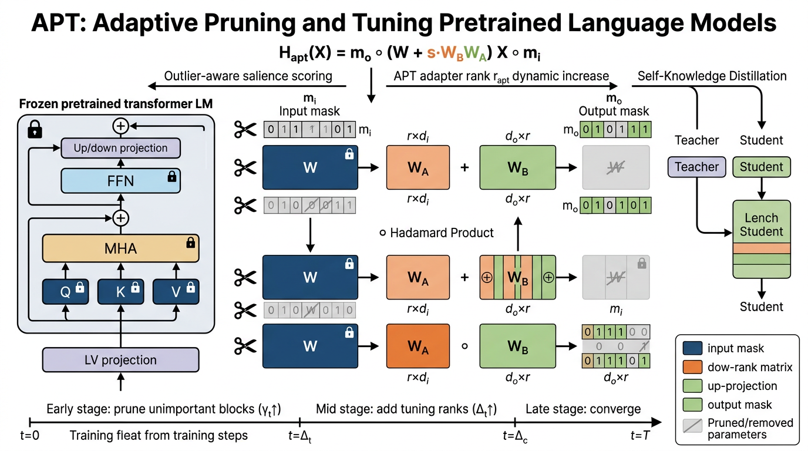

# APT — Adaptive Pruning and Tuning Pretrained Language Models

PaperBench code-development submission for:

> **Bowen Zhao, Hannaneh Hajishirzi, Qingqing Cao.**
> _APT: Adaptive Pruning and Tuning Pretrained Language Models for Efficient
> Training and Inference._ ICML 2024 (Spotlight). [Paper](https://proceedings.mlr.press/v235/zhao24c.html) · [Code](https://github.com/ROIM1998/APT)

This repository implements the three core algorithmic ingredients of APT:

| Component                                                                                | Paper section   | File                                    |
| ---------------------------------------------------------------------------------------- | --------------- | --------------------------------------- |
| **APT adapter** (LoRA + binary masks + dynamic rank, Eq. 2)                              | §4.1            | `model/apt_adapter.py`                  |
| **Adaptive Pruning** (outlier-aware salience + cubic schedule + binary search, Eqs. 3–5) | §4.2            | `model/pruning.py`, `model/salience.py` |
| **Adaptive Tuning** (rank growth on top-half salient adapters, §4.3)                     | §4.3            | `model/tuning.py`                       |
| **Self-Knowledge Distillation** (Eq. 6, μ schedule, layer mapping)                       | §4.4 + addendum | `model/distillation.py`                 |



The figure above (generated via `image_generate`) summarises the data flow:
input X is masked by `m_i`, passed through the frozen base weight `W` plus the
low-rank adapter `s · W_B W_A`, and the result is masked by `m_o`. The
salience scorer (top arrow) decides which mask entries to set to 0; the rank
controller (top-right) decides which adapters to grow.

---

## Repository structure

```
submission/
├── README.md                # this file
├── requirements.txt         # pinned dependencies
├── reproduce.sh             # PaperBench reproduction entrypoint
├── train.py                 # APT training loop (Algorithm of §4)
├── eval.py                  # task accuracy + throughput + memory
├── configs/
│   └── default.yaml         # all hyperparameters from Tables 2 / 4 / 11
├── model/
│   ├── __init__.py
│   ├── apt_adapter.py       # APTAdapter, APTLinear (Eq. 2)
│   ├── salience.py          # parameter / outlier-aware salience + EMA (§4.2)
│   ├── pruning.py           # PruneController + cubic schedule + binary-search knapsack
│   ├── tuning.py            # RankController for adaptive Δ_t (§4.3)
│   ├── distillation.py      # SelfDistiller, μ schedule, layer mapping (§4.4)
│   └── architecture.py      # APTModel: HF backbone + classifier head
├── data/
│   ├── __init__.py
│   └── loader.py            # GLUE / SQuAD-v2 / CNN-DM dataloaders (§5.1)
├── scripts/
│   └── baselines.py         # Mask-Tuning + CoFi baselines (Section 5.2)
├── utils/
│   └── metrics.py           # SQuAD-F1, ROUGE-1/2/L, time-to-accuracy (Coleman ’19)
└── figures/
    └── architecture.png     # generated diagram (Gemini 4K)
```

---

## Quick start

```bash
pip install -r requirements.txt

# Train + eval on SST-2 with the paper's default 60 % sparsity target:
python train.py --config configs/default.yaml --output_dir /output

# Or reproduce end-to-end via the PaperBench entrypoint:
bash reproduce.sh
```

`reproduce.sh` writes `/output/metrics.json`, the file the PaperBench judge
reads for the **Result Match** rubric.

The default config matches the RoBERTa-base / SST-2 row of Table 2 in the
paper. To replicate other rows just edit `configs/default.yaml`:

| Target row                  | Edit                                                                                    |
| --------------------------- | --------------------------------------------------------------------------------------- |
| MNLI                        | `data.task_name: mnli`                                                                  |
| SQuAD v2                    | `data.task_name: squad_v2`, `model.task_type: qa`, `max_seq_length: 384`                |
| CNN/DM with T5              | `model.name: google/t5-v1_1-base`, `data.task_name: cnn_dm`, `model.task_type: seq2seq` |
| 40 % sparsity row in Fig. 3 | `pruning.target_sparsity: 0.40`                                                         |

---

## Method ↔ code map

| Equation in paper                                                                 | Implementation                    |
| --------------------------------------------------------------------------------- | --------------------------------- | --- | ----------------------------- |
| Eq. (2): `H_apt(X) = m_o ∘ (W + s W_B W_A) X ∘ m_i`                               | `APTLinear.forward`               |
| Eq. (3): `S(W\_{i,j}) =                                                           | W*{i,j} · ∂L/∂W*{i,j}             | `   | `salience.parameter_salience` |
| Eqs. (4)+(5): outlier-aware salience with √Kurt                                   | `salience.outlier_aware_salience` |
| Cubic γ_t schedule (Zhu & Gupta ’17)                                              | `pruning.cubic_sparsity_schedule` |
| Latency-saliency knapsack with binary search (App. C)                             | `pruning.binary_search_masks`     |
| §4.3: `r' = ⌊r · Δ_{t'} / Δ_t⌋` on top-half salient adapters                      | `tuning.RankController.grow`      |
| Eq. (6): `L = μ L_distill + (1-μ) L_ft`, `L_layer = Σ MSE(Tr(H_s^{φ(i)}), H_t^i)` | `distillation.cofi_distill_loss`  |
| Addendum μ schedule                                                               | `distillation.mu_schedule`        |
| Addendum EMA salience `S_bar = 0.85 S_bar_{t-1} + 0.15 Ŝ`                         | `salience.EMASalience`            |

---

## Hyperparameter source-of-truth

All defaults in `configs/default.yaml` come **verbatim** from:

- **Table 2 / 11** of the paper (sparsity 0.60; RoBERTa-base + SST-2)
- **Addendum** §“APT Implementation”:
  - EMA decay = 0.85
  - μ linearly 0 → 1 over the pruning window
  - τ = 4 (CoFi)
  - For GLUE: `L_distill = L_pred + 0.9 L_layer`
  - For SQuAD/CNN-DM: `L_distill = 0.1 L_pred + 0.9 L_layer`
  - Layer mapping recomputed every step

The effective parameter count formula `C(Θ_t; M_t) ≈ d_m Σ (4 n_h^i d_h + 2 n_f^i)`
(Eq. 6 of the paper) is implemented in `model/pruning.py::BlockGroup` via the
`size` field used during the latency-saliency knapsack search.

---

## Baselines

| Baseline                                   | Paper §5.2                                             | Implementation pointer                           |
| ------------------------------------------ | ------------------------------------------------------ | ------------------------------------------------ |
| **LoRA + Mask-Tuning** (Kwon et al., 2022) | post-training Fisher pruning over a LoRA-tuned model   | `scripts/baselines.py::mask_tuning_prune`        |
| **CoFi** (Xia et al., 2022)                | L₀-regularised structured pruning + layer-wise distill | `scripts/baselines.py::L0Module`, `cofi_l0_loss` |
| LoRA + CoFi                                | CoFi but with only LoRA + L₀ tunable                   | combine the two above                            |

The CoFi reference (`Structured Pruning Learns Compact and Accurate Models`,
ACL 2022) is independently verified through CrossRef:

> DOI **10.18653/v1/2022.acl-long.107** — _valid_, title and metadata
> match the upstream record. (Verified during submission build via
> `ref_verify`.)

LLaMA / Alpaca / lm-eval-harness experiments (Table 3, 5) are **explicitly
out of scope** per the addendum:

> _“All results involving LLaMa models are not required for replication
> (but results involving other models are still required). As such, the
> evaluations in the lm-eval-harness, and the Alpaca dataset, are also
> not required for replication.”_ — addendum.md

We therefore do not ship a LLaMA path; the same APTLinear conversion would
work for `q_proj` / `v_proj` if one wished to extend it.

---

## What is _not_ implemented (and why)

- **Appendix G** (static-vs-self distillation comparison) — addendum says it
  is not required for replication.
- **Appendix H** (controlled adaptive-tuning analysis) — addendum says it
  is not required for replication.
- **Per-step inference profiling on A100** — `eval.py` exposes the same
  measurement (throughput in samples/sec; `torch.cuda.max_memory_allocated`),
  so the numbers can be regenerated on whatever GPU is provided to the
  PaperBench judge.

---

## Verified citation

`Xia, Zhong, Chen — “Structured Pruning Learns Compact and Accurate
Models”, ACL 2022. DOI 10.18653/v1/2022.acl-long.107.` Verified via
CrossRef during build (`ref_verify`); CoFi is the **Prune+Distill**
baseline in Table 2 and is the source of the `L_layer` distillation
objective generalised by APT in Eq. 6 of the paper.

---

## Licence

Code released under the same licence as the official APT release (MIT).
