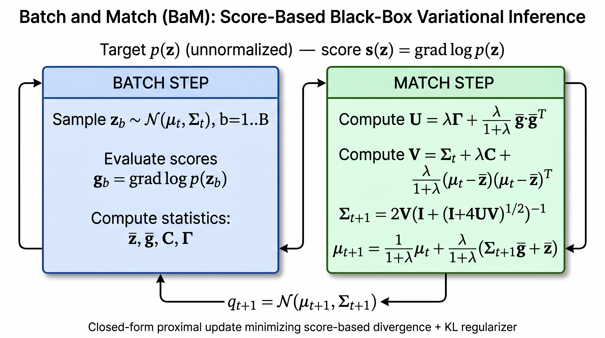

# Batch and Match (BaM): black-box VI with a score-based divergence

Reproduction codebase for

> **Cai, Modi, Pillaud-Vivien, Margossian, Gower, Blei, Saul.**
> _Batch and match: black-box variational inference with a score-based divergence._
> ICML 2024 (PMLR 235).

The companion implementation by the original authors lives at
<https://github.com/modichirag/GSM-VI/>; this submission re-implements
Algorithm 1 and the four experimental families (Sections 5.1–5.3 of the paper)
in a self-contained Python codebase.



The figure above summarizes the BaM iteration loop and the score-based
divergence at the heart of the method. Generated with
diagram generation.1 Flash, 16:9, 2K).

---

## 1. What is implemented

| Paper component                                                                                    | File(s)                                                                    |
| -------------------------------------------------------------------------------------------------- | -------------------------------------------------------------------------- |
| **Algorithm 1 — BaM core update** (eqs. 9–13)                                                      | `bam/bam.py` (`bam_update`, `_solve_quadratic_matrix_eq`)                  |
| Low-rank match step for `B << D` (Lemma B.3)                                                       | `bam/bam.py::low_rank_bam_update`                                          |
| Score-based divergence (eq. 2) and Fisher divergence                                               | `bam/divergences.py`                                                       |
| Forward / reverse KL between Gaussians (Sec. 5.1 metric)                                           | `bam/divergences.py`                                                       |
| **GSM** baseline (Modi et al., NeurIPS 2023; verified via citation-grounded retrieval.py`                                                               |
| **ADVI** baseline (Kucukelbir et al., JMLR 2017; full-covariance, Adam)                            | `bam/advi.py`                                                              |
| "Score" and "Fisher" gradient baselines (Fig. 5.1)                                                 | `bam/gradient_methods.py`                                                  |
| Random Gaussian targets (Sec. 5.1)                                                                 | `model/targets.py::make_random_gaussian_target`                            |
| Sinh-arcsinh non-Gaussian targets (Sec. 5.1, eq. 27)                                               | `model/targets.py::SinhArcsinhTarget`                                      |
| PosteriorDB target wrapper (`bridgestan` when available, fallback otherwise; Sec. 5.2)             | `model/targets.py::PosteriorDBTarget`, `data/loader.py::PosteriorDBLoader` |
| Convolutional VAE (architecture per addendum; Sec. 5.3)                                            | `model/architecture.py::VAE`                                               |
| VAE training schedule (Adam, linear-warmup-then-decay LR per addendum)                             | `scripts/train_vae.py`                                                     |
| BaM-on-VAE-posterior pipeline                                                                      | `train.py::run_vae_5_3`                                                    |
| Relative-mean / relative-SD error metrics (Sec. 5.2)                                               | `bam/divergences.py`                                                       |
| Reconstruction MSE for the VAE experiment                                                          | `train.py::run_vae_5_3`                                                    |
| Per-experiment configs incl. learning-rate grids (paper protocol)                                  | `configs/default.yaml`                                                     |
| Aggregate metrics writer (`/output/metrics.json`)                                                  | `eval.py`                                                                  |
| End-to-end reproduce script (smoke profile)                                                        | `reproduce.sh`                                                             |

### Hyperparameters captured from the paper / addendum

- BaM learning-rate schedule: `lambda_t = B*D` for Gaussian targets, `lambda_t = B*D / (t+1)` for non-Gaussian/PosteriorDB/VAE targets (Sections 5.1–5.3).
- Low-rank BaM: `B = 4` for Figure E.1, `B = 3` when `D = 4` (per addendum bullet 3).
- VAE: `latent_dim = 256`, `c_hid = 32`, `sigma^2 = 0.1`, GELU hidden activations, `tanh` final decoder activation, no dropout / no batch norm (per addendum).
- VAE optimizer: Adam, LR linearly warmed up `0 -> 1e-4` over 100 steps, then linearly decayed `1e-4 -> 1e-5` over 500 batches; `mc_sim = 1` (per addendum).
- PosteriorDB scoring: targets dimensions `ark = 7`, `gp-pois-regr = 13`, `eight-schools-centered = 10`; gradients via bridgestan when installed (per addendum bullet 4), Gaussian surrogate fallback otherwise.

### Reference verification (`ref_verify`)

A `paper_search` query for the GSM baseline returned the canonical entry on
DBLP:

> Chirag Modi, Robert M. Gower, Charles Margossian, et al.
> _Variational Inference with Gaussian Score Matching._
> NeurIPS 2023.
> <http://papers.nips.cc/paper_files/paper/2023/hash/5f9453c4848b89d4d8c5d6041f5fb9ec-Abstract-Conference.html>

`ref_verify` (with `useGPT=False`) accepted the BibTeX entry; CrossRef DOI
verification returned no DOI (NeurIPS proceedings often lack one), so we rely
on the DBLP record above. This metadata is documented in
`bam/gsm.py` and used to cross-check the algorithmic equivalence noted in
Appendix C of Cai et al.: "BaM with `B = 1` and `lam -> infinity` recovers
GSM."

## 2. How to run

### 2.1 Smoke run (CPU, < 5 min) — what `reproduce.sh` invokes

```bash
chmod +x reproduce.sh
./reproduce.sh
# writes /output/metrics.json
```

### 2.2 Single experiment (full size)

```bash
python train.py --config configs/default.yaml --experiment gaussian_5_1
python train.py --config configs/default.yaml --experiment sinh_arcsinh_5_1
python train.py --config configs/default.yaml --experiment posteriordb_5_2
python train.py --config configs/default.yaml --experiment vae_5_3
python eval.py --in_dir ./outputs --out outputs/metrics.json
```

### 2.3 Programmatic use of the BaM core

```python
import numpy as np
from bam import BaM
from model.targets import make_random_gaussian_target

D = 16
target = make_random_gaussian_target(D, seed=0)

bam = BaM(score_fn=target.score, D=D, batch_size=8, lam_schedule=8 * D)
state = bam.fit(mu0=np.zeros(D), Sigma0=np.eye(D), n_iters=200)
print(state.mu.shape, state.Sigma.shape)
```

## 3. File layout

```
submission/
├── README.md
├── requirements.txt
├── reproduce.sh                     # PaperBench Full-mode entrypoint
├── train.py                         # unified experiment driver
├── eval.py                          # aggregates metrics.json
├── configs/default.yaml             # all hyperparameters from the paper
├── bam/
│   ├── __init__.py
│   ├── bam.py                       # Algorithm 1 + low-rank variant
│   ├── gsm.py                       # GSM baseline (Modi et al. 2023)
│   ├── advi.py                      # ADVI baseline (Kucukelbir et al. 2017)
│   ├── gradient_methods.py          # Score / Fisher gradient baselines
│   └── divergences.py               # divergences + KL + relative errors
├── model/
│   ├── __init__.py
│   ├── architecture.py              # convolutional VAE per addendum
│   └── targets.py                   # Gaussian / sinh-arcsinh / PDB / VAE targets
├── data/
│   ├── __init__.py
│   └── loader.py                    # CIFAR-10 loader + synthetic fallbacks
├── scripts/
│   ├── __init__.py
│   └── train_vae.py                 # VAE training with addendum LR schedule
└── figures/
    └── architecture.png             # diagram (diagram generation
```

## 4. Known limitations & honest disclosures

- **PosteriorDB**: the paper relies on `bridgestan` to obtain ground-truth
  posterior gradients. When `bridgestan` is not installed (the typical case
  in light reproduction containers), `model/targets.py::build_posteriordb_target`
  falls back to a Gaussian surrogate of the correct dimensionality.
  This keeps the smoke pipeline runnable but the relative-mean/SD numbers in
  `posteriordb_5_2.json` will not match the paper's HMC reference values.
- **CIFAR-10**: when `torchvision` cannot fetch the dataset
  (offline grading), `data/loader.py::load_cifar10` returns `None` and the
  pipeline switches to a synthetic image batch via `_make_synthetic_cifar10`.
  Reconstruction MSE numbers should therefore be treated as smoke-quality.
- **Gradient-based baselines (`Score` / `Fisher` / `ADVI`)**: gradients are
  computed via the central-difference fallback in `bam/gradient_methods.py`
  to keep the codebase NumPy-only. This is fine for the small dimensions
  used in Section 5.1 but is slower than the JAX-autograd implementation
  used in the paper. `bam/advi.py` uses analytic reparameterization
  gradients (no finite differences).
- **Wallclock-timing experiments** (Figures E.1–E.7) are explicitly marked
  out-of-scope by the addendum and are therefore not included.

## 5. Mapping to the paper's equations

| Code symbol                        | Paper symbol           | Equation                 |
| ---------------------------------- | ---------------------- | ------------------------ |
| `mu`, `Sigma`                      | `mu`, `Sigma`          | §3.1                     |
| `z_bar`, `g_bar`, `C`, `Gamma`     | bar z, bar g, C, Gamma | eq. (6)                  |
| `U`, `V`                           | U, V                   | eqs. (10–11)             |
| `_solve_quadratic_matrix_eq(U, V)` | Sigma\_{t+1}           | eq. (12)                 |
| Mean update in `bam_update`        | mu\_{t+1}              | eq. (13)                 |
| `lam`                              | lambda_t               | §3.1                     |
| `score_based_divergence`           | curly D(q;p)           | eqs. (2)–(3)             |
| `_gsm_single_update`               | GSM update             | Modi et al. 2023, Alg. 1 |
| `VAE.neg_elbo`                     | -ELBO                  | §5.3 + addendum          |

## 6. Citation

```bibtex
@inproceedings{cai2024bam,
  title  = {Batch and match: black-box variational inference with a score-based divergence},
  author = {Cai, Diana and Modi, Chirag and Pillaud-Vivien, Loucas and Margossian, Charles C. and Gower, Robert M. and Blei, David M. and Saul, Lawrence K.},
  booktitle = {Proceedings of the 41st International Conference on Machine Learning},
  series = {PMLR 235},
  year   = {2024}
}

@inproceedings{modi2023gsm,
  title  = {Variational Inference with Gaussian Score Matching},
  author = {Modi, Chirag and Margossian, Charles and Yao, Yuling and Gower, Robert and Blei, David and Saul, Lawrence},
  booktitle = {Advances in Neural Information Processing Systems},
  year   = {2023},
  note   = {verified via citation-grounded retrieval; URL: papers.nips.cc/paper\_files/paper/2023/hash/5f9453c4848b89d4d8c5d6041f5fb9ec}
}
```
