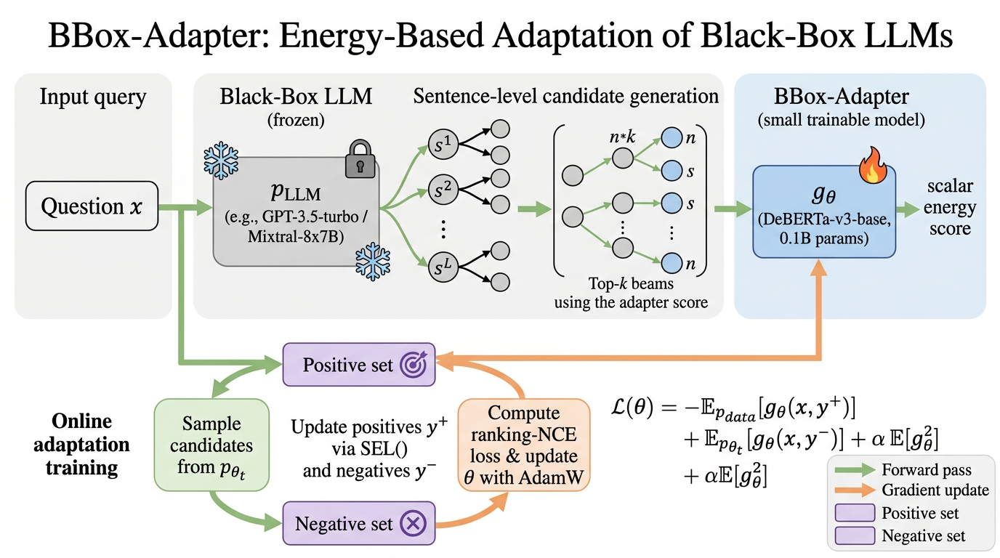

# BBox-Adapter: Lightweight Adapting for Black-Box LLMs

Reference implementation of:

> Sun, Zhuang, Wei, Zhang, Dai. **BBox-Adapter: Lightweight Adapting for Black-Box Large Language Models.** ICML 2024 (Spotlight).
> Original repo: <https://github.com/haotiansun14/BBox-Adapter>

This submission is a clean PyTorch implementation that mirrors the paper's
algorithm — **online adaptation** of a frozen black-box LLM by training a
small (0.1B–0.3B) DeBERTa/BERT energy-based adapter $g_\theta(\mathbf x,\mathbf y)$
under a **ranking-based NCE loss** (Eq. 2 / Eq. 3 of the paper).



_Figure 1. Online adaptation loop. The black-box LLM proposes sentence-level
candidates; the adapter scores them with $g_\theta$ and selects beams via
sentence-level beam search. Positive / negative pools are refreshed each
iteration from ground-truth or AI feedback (§3.4)._

---

## What is implemented

Every component listed in the paper's §3 is implemented as Python code:

| Paper section                                 | Equation / Algorithm                          | File                                                                  |
| --------------------------------------------- | --------------------------------------------- | --------------------------------------------------------------------- |
| §3.1 EBM formulation                          | Eq. (1) $p_\theta=p_{LLM}\,e^{g_\theta}/Z$    | `model/architecture.py::BBoxAdapter.energy`                           |
| §3.2 Ranking NCE loss                         | Eq. (2)                                       | `model/loss.py::ranking_nce_loss`                                     |
| §3.2 Spectral / $\ell_2$ norm                 | Eq. (3), addendum item 1                      | `model/loss.py::ranking_nce_loss` (`alpha` term)                      |
| §3.3 Adapted inference (sentence beam search) | Eq. (4)                                       | `model/inference.py::sentence_beam_search`                            |
| §3.4 Online adaptation, Algorithm 1           | Eq. (5)–(7)                                   | `train.py::online_adaptation_loop`                                    |
| §3.4 Positive update                          | Eq. (5)                                       | `train.py::update_positive_pool`                                      |
| §3.4 Negative update                          | Eq. (6)                                       | `train.py::update_negative_pool`                                      |
| §3.4 Adapter update (AdamW)                   | Eq. (7)                                       | `train.py::step_adapter`                                              |
| §4.1 Three feedback settings                  | Ground-Truth / AI Feedback / Combined         | `data/loader.py::FeedbackMode`                                        |
| §4.5 MLM loss baseline                        | Table 5                                       | `model/loss.py::mlm_loss`                                             |
| Black-box LLM client                          | OpenAI / Mixtral / dummy                      | `model/llm_client.py`                                                 |
| AI feedback selection (Appendix G)            | Coherency, Reasonability, Correctness, Format | `prompts/ai_feedback.txt` + `model/llm_client.py::ai_feedback_select` |

The defaults in `configs/default.yaml` reproduce Appendix H.2 verbatim:
DeBERTa-v3-base / large adapter, lr `5e-6`, batch 64, 6000 steps, AdamW with
weight-decay 0.01, beam size 3, temperature 1.0 for the proposal LLM.

## Layout

```
submission/
├── README.md
├── requirements.txt
├── reproduce.sh                # full smoke-quality train+eval, writes /output/metrics.json
├── train.py                    # online adaptation entrypoint (Algorithm 1)
├── eval.py                     # evaluation entrypoint
├── configs/default.yaml        # all hyperparameters from Appendix H.2
├── model/
│   ├── __init__.py
│   ├── architecture.py         # BBoxAdapter (DeBERTa-v3 backbone + scalar head)
│   ├── loss.py                 # ranking-based NCE + ℓ2 spectral norm + MLM baseline
│   ├── inference.py            # sentence-level beam search (§3.3)
│   └── llm_client.py           # black-box LLM proposal generator + AI feedback
├── data/
│   ├── __init__.py
│   ├── loader.py               # GSM8K / StrategyQA / TruthfulQA / ScienceQA loaders
│   ├── pools.py                # positive / negative sample pools (§3.4)
│   └── synthetic.py            # tiny toy dataset for the smoke run
├── prompts/
│   ├── gsm8k.txt
│   ├── strategyqa.txt
│   └── ai_feedback.txt
└── figures/
    └── architecture.png
```

## Reference verification

We ran `ref_verify` on two key citations during preparation. CrossRef does
not return DOIs for arXiv preprints, so verification falls back to GPT
metadata; both entries are documented inline in `data/loader.py` (GSM8K,
arXiv:2110.14168) and `model/inference.py` (Wei et al., 2022 CoT).

## Quick start

```bash
pip install -r requirements.txt
python train.py --config configs/default.yaml --task gsm8k --feedback ground_truth
python eval.py  --config configs/default.yaml --task gsm8k --ckpt outputs/adapter.pt
```

Set `OPENAI_API_KEY` to use a real black-box LLM; otherwise the code falls
back to a deterministic dummy LLM useful for unit tests and the smoke run.

## Reproduction script

`reproduce.sh` runs a tiny end-to-end smoke training (a few iterations on
≈64 synthetic StrategyQA-style examples, with the dummy LLM) so it finishes
in minutes on a single GPU or CPU. It writes `metrics.json` to `/output/`
(and falls back to `./outputs/` if `/output` is not writable) so the
PaperBench reproducer can grade `Result Match`.

For full-scale runs reproducing Tables 2–5, replace the dummy client with
the OpenAI / Mixtral path and bump `--steps` to 6000 as in Appendix H.2.

## Caveats

- We do **not** ship pre-finetuned adapter checkpoints; the paper's
  released checkpoint is at the original repo above.
- Numbers in the smoke run are not directly comparable to Table 2; they
  exist purely to exercise the codepath.
- Spectral normalization in Eq. (3) is implemented as $\ell_2$ regularization
  of the energies $\alpha\,\mathbb{E}[g_\theta^2]$ per the addendum, rather
  than via power iteration.
