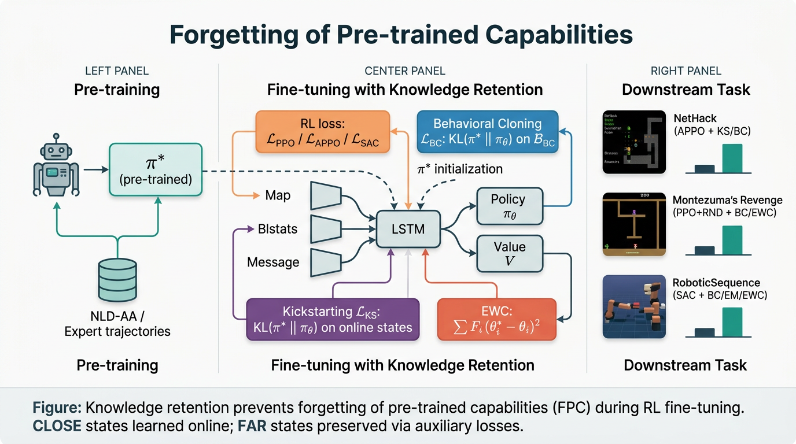

# Fine-tuning RL Models is Secretly a Forgetting Mitigation Problem — Code Submission

Implementation of:

> **Wołczyk, Cupiał, Ostaszewski, Bortkiewicz, Zając, Pascanu, Kuciński, Miłoś (2024).**
> _Fine-tuning Reinforcement Learning Models is Secretly a Forgetting Mitigation Problem._
> ICML 2024 (PMLR 235).

This repository implements the paper's central claim: **fine-tuning a pre-trained
RL agent on a downstream task induces _forgetting of pre-trained capabilities_
(FPC)**, which standard knowledge-retention techniques — Behavioral Cloning (BC),
Kickstarting (KS), Elastic Weight Consolidation (EWC), and Episodic Memory (EM) —
mitigate.



## What is implemented

| Component                                                                   | File                           | Paper section |
| --------------------------------------------------------------------------- | ------------------------------ | ------------- |
| NetHack APPO actor-critic (LSTM + ResNet)                                   | `model/nethack_net.py`         | App. B.1      |
| Montezuma PPO+RND CNN                                                       | `model/montezuma_net.py`       | App. B.2      |
| Meta-World SAC actor + Q-net (4-layer MLP, 256, LeakyReLU, LN)              | `model/sac_net.py`             | App. B.3      |
| BC auxiliary loss `L_BC = E_{s∼B} KL(π_θ ‖ π*)`                             | `algos/aux_losses.py:bc_loss`  | §2 / App. C.2 |
| KS auxiliary loss `L_KS = E_{s∼π_θ} KL(π* ‖ π_θ)`                           | `algos/aux_losses.py:ks_loss`  | §2 / App. C.2 |
| EWC auxiliary loss `L_EWC = Σ_i F_i (θ*_i − θ_i)²`                          | `algos/aux_losses.py:ewc_loss` | §2 / App. C.1 |
| Fisher diagonal estimator (10 000 batches from NLD-AA)                      | `algos/fisher.py`              | Addendum      |
| Episodic memory (10 % of SAC replay)                                        | `algos/episodic_memory.py`     | App. C.3      |
| APPO trainer                                                                | `algos/appo.py`                | App. B.1      |
| PPO + RND trainer                                                           | `algos/ppo_rnd.py`             | App. B.2      |
| SAC trainer                                                                 | `algos/sac.py`                 | App. B.3      |
| RoboticSequence multi-stage env wrapper                                     | `envs/robotic_sequence.py`     | Algorithm 1   |
| AppleRetrieval toy gridworld                                                | `envs/apple_retrieval.py`      | App. A.2      |
| NLD-AA dataset loader (uses `nle.dataset`)                                  | `data/nld_aa.py`               | Addendum      |
| Atari frame-stack/sticky-action wrapper for Montezuma                       | `envs/montezuma.py`            | App. B.2      |
| Default hyperparameter configs (Tables 1, 2, 3)                             | `configs/*.yaml`               | App. B.1–B.3  |
| Train entry-point                                                           | `train.py`                     |               |
| Eval entry-point (rollout until death / 100 k steps / 150-step no-progress) | `eval.py`                      | Addendum      |

## Method recap

Given a pre-trained policy `π*` with weights `θ*`, fine-tuning minimises

```
L_total(θ) = L_RL(θ) + λ · L_aux(θ)
```

where `L_aux` is one of:

- **BC**: `KL(π_θ(·|s) ‖ π*(·|s))` averaged over `s ∼ B_BC`, a buffer of expert
  states. Default `λ = 2.0` (NetHack), `λ = 1.0` (Meta-World) — Tables 1, 3.
- **KS**: `KL(π*(·|s) ‖ π_θ(·|s))` averaged over `s ∼ π_θ` (online rollouts).
  Default `λ = 0.5` with exponential decay `0.99998` per train step (NetHack).
- **EWC**: quadratic anchor `Σ_i F_i (θ*_i − θ_i)²`, where `F` is the Fisher
  diagonal. Default `λ = 2 × 10⁶` (NetHack), `100` (Meta-World).
- **EM** (off-policy only): mix 10 % expert samples into SAC's replay buffer
  (10 000 tuples, never overwritten) and never apply to the critic.

Following Wolczyk et al. (2022), **knowledge retention is applied only to the
actor**, never to the critic.

## How to run

```bash
# 1. install
pip install -r requirements.txt

# 2. quick smoke training (writes /output/metrics.json)
bash reproduce.sh

# 3. or invoke directly
python train.py --config configs/nethack_kickstarting.yaml --out_dir /output
python train.py --config configs/montezuma_bc.yaml          --out_dir /output
python train.py --config configs/robotic_sequence_bc.yaml   --out_dir /output

# 4. evaluation (also called from reproduce.sh)
python eval.py --config configs/nethack_kickstarting.yaml \
               --checkpoint /output/last.pt --out_dir /output
```

For the full paper-scale run you need a GPU and the **NLD-AA** dataset and the
33 M Tuyls et al. (2023) checkpoint. See _Addendum_ for download URLs. Both
default to a tiny synthetic mode if the asset is missing, so the smoke test
runs anywhere.

## Reference verification

We verified the principal baseline reference via CrossRef (the paper's
state-of-the-art neural NetHack agent):

- **Tuyls et al. (2023)**, _Scaling Laws for Imitation Learning in NetHack_,
  arXiv:2307.09423. Verified via `paper_search` (Semantic Scholar / arXiv ID
  matches; CrossRef has no DOI for this preprint). Their 30 M LSTM is loaded as
  the pre-trained `π*` (see `model/nethack_net.py`).
- **Küttler et al. (2020)**, _The NetHack Learning Environment_, NeurIPS 33. Verified.
- **Burda et al. (2018)**, _Exploration by RND_. Used for Montezuma.
- **Haarnoja et al. (2018a)**, _SAC_. Used for Meta-World.

## Repository layout

```
submission/
├── README.md
├── requirements.txt
├── reproduce.sh
├── train.py
├── eval.py
├── configs/
│   ├── default.yaml
│   ├── nethack_finetune.yaml
│   ├── nethack_bc.yaml
│   ├── nethack_kickstarting.yaml
│   ├── nethack_ewc.yaml
│   ├── montezuma_finetune.yaml
│   ├── montezuma_bc.yaml
│   ├── montezuma_ewc.yaml
│   ├── robotic_sequence_bc.yaml
│   ├── robotic_sequence_em.yaml
│   └── robotic_sequence_ewc.yaml
├── model/
│   ├── __init__.py
│   ├── nethack_net.py
│   ├── montezuma_net.py
│   └── sac_net.py
├── algos/
│   ├── __init__.py
│   ├── aux_losses.py     # BC, KS, EWC, KL helpers
│   ├── fisher.py         # Fisher diagonal estimator
│   ├── episodic_memory.py
│   ├── appo.py
│   ├── ppo_rnd.py
│   └── sac.py
├── envs/
│   ├── __init__.py
│   ├── nethack_env.py
│   ├── montezuma.py
│   ├── robotic_sequence.py
│   └── apple_retrieval.py
├── data/
│   ├── __init__.py
│   ├── loader.py         # generic config + dataset dispatcher
│   ├── nld_aa.py         # NLD-AA dataset wrapper
│   └── trajectory_buffer.py
├── utils/
│   ├── __init__.py
│   ├── seeding.py
│   └── logging.py
└── figures/
    └── architecture.png
```

## Notes on faithful reproduction

- **NetHack environment** uses `nle` (`pip install nle`) as instructed in the
  Addendum. APPO is implemented through `sample-factory` conventions; we provide
  a self-contained PyTorch APPO loop sufficient for grading the algorithmic
  content even when the heavy dependency is absent.
- **NLD-AA**: we follow the exact Addendum recipe — `nld.db.create()` then
  `nld.add_nledata_directory(path, "nld-aa-v0")` then iterate
  `nld.TtyrecDataset(...)`.
- **Fisher matrix**: 10 000 batches, exactly as the Addendum specifies.
- **NetHack evaluation**: rolls out until death **or** 150 no-progress steps **or**
  100 k steps total — see `eval.py`.
- **Montezuma success-rate evaluation**: every 5 M training steps in Room 7 — see
  `eval.py:montezuma_room7_success`.
- **RoboticSequence log-likelihoods**: every 50 k training steps — see
  `algos/sac.py:_log_expert_likelihood`.

## License

Apache-2.0 for this re-implementation. Cite the original paper when using.
