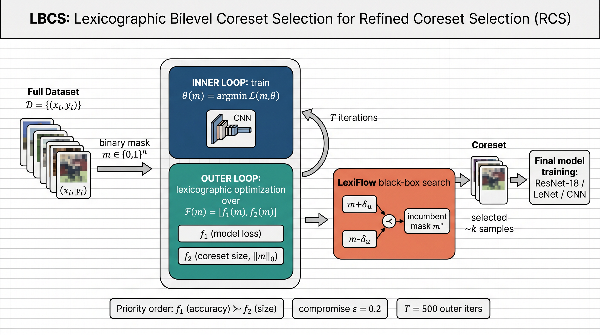

# LBCS — Lexicographic Bilevel Coreset Selection

Reference implementation of:

> **Refined Coreset Selection: Towards Minimal Coreset Size under Model Performance Constraints.**
> Xiaobo Xia, Jiale Liu, Shaokun Zhang, Qingyun Wu, Hongxin Wei, Tongliang Liu.
> _International Conference on Machine Learning (ICML)_, 2024.
> Original code: <https://github.com/xiaoboxia/LBCS>

The paper introduces **Refined Coreset Selection (RCS)** — instead of fixing a
coreset size _k_ up front, RCS additionally minimises _k_ under a model
performance constraint. RCS is a _bilevel_ lexicographic optimisation problem
with two ordered objectives:

| symbol  | objective                               | meaning                        |
| :-----: | --------------------------------------- | ------------------------------ |
| `f1(m)` | `(1/n) Σᵢ ℓ(h(xᵢ; θ(m)), yᵢ)`           | full-data CE loss of θ(m)      |
| `f2(m)` | `‖m‖₀`                                  | size of the coreset (mask sum) |
|         | _priority_: `f1 ≻ f2` (loss is primary) |                                |

This repo implements the proposed method **LBCS = Lexicographic Bilevel Coreset
Selection**, where the inner loop trains a network on the masked subset and
the outer loop performs a randomised direct search over the binary mask `m`
under _practical_ lexicographic relations (Algorithm 2, Appendix A).

## Architecture



Outer loop = **LexiFlow** (a randomised direct search adapted from
Zhang et al. 2023b/c; Wu et al. 2021). Inner loop = standard SGD/Adam training
of a proxy CNN. Outputs = optimised binary mask + final target network.

## File layout

```
submission/
├── README.md                ← this file
├── requirements.txt
├── reproduce.sh             ← PaperBench Full-mode entrypoint
├── train.py                 ← Algorithm 1: outer LexiFlow + inner SGD/Adam + final retrain
├── eval.py                  ← reload mask + retrain target net + report test acc
├── configs/
│   └── default.yaml         ← every hyperparameter from the paper (§5.1–§5.3, App. D.2)
├── model/
│   ├── __init__.py
│   └── architecture.py      ← LeNet, ConvNet (Zhou 2022), ConvNetSVHN, ConvNetCIFAR, ResNet-18
├── data/
│   ├── __init__.py
│   └── loader.py            ← F-MNIST, SVHN, CIFAR-10, MNIST-S; symmetric noise; class imbalance
├── baselines/
│   ├── __init__.py
│   └── scoring.py           ← Uniform / EL2N / GraNd / Moderate / CCS / Influential / Probabilistic
├── utils/
│   ├── __init__.py
│   ├── lexico.py            ← lexicographic relations (Defn. 1 + practical, App. A)
│   ├── lexiflow.py          ← Algorithm 2 (LexiFlow randomised direct search)
│   └── inner.py             ← inner-loop trainer + f1/f2 evaluators + outer-loop closure
└── figures/architecture.png
```

## What is implemented

| Paper item                                                                       | Implemented in                                                                                        |
| -------------------------------------------------------------------------------- | ----------------------------------------------------------------------------------------------------- |
| Equation 1 — `f1(m)` and inner-loop loss `L(m,θ)`                                | `utils/inner.py: compute_f1, inner_train`                                                             |
| Equation 2 — `f2(m) = ‖m‖₀`                                                      | `utils/inner.py: f2_value`                                                                            |
| §3.1 lexicographic bilevel formulation (5)                                       | `train.py` (overall pipeline)                                                                         |
| Definition 1 — exact lexicographic relations                                     | `utils/lexico.py: lex_eq, lex_lt, lex_le`                                                             |
| Eq. 13–15 — practical lexicographic relations + `F_H` thresholds                 | `utils/lexico.py: practical_*, History.thresholds`                                                    |
| Algorithm 1 — LBCS top-level loop                                                | `train.py: main`                                                                                      |
| Algorithm 2 — LexiFlow direct search w/ delta-shrink and random restart          | `utils/lexiflow.py: lexiflow_search`                                                                  |
| §3.2 acceleration tricks: warmup + group-mask                                    | `utils/inner.py` (`group_size`), `train.py`                                                           |
| §5.1 / Figure 1 ConvNet (Zhou 2022)                                              | `model/architecture.py: ConvNet, BorsosConvNet`                                                       |
| §5.2 LeNet (F-MNIST), CNNs (SVHN), ResNet-18 (CIFAR-10)                          | `model/architecture.py: LeNet, ConvNetSVHN, ConvNetSVHNTarget, ConvNetCIFAR, build_model('resnet18')` |
| §5.2 SGD + cosine LR for ResNet-18 / CIFAR-10                                    | `configs/default.yaml: scheduler: cosine` + `inner_train`                                             |
| §5.3 symmetric label-noise injection                                             | `data/loader.py: inject_symmetric_noise`                                                              |
| §5.3 exponential class-imbalance                                                 | `data/loader.py: make_class_imbalanced`                                                               |
| Baselines: Uniform / EL2N / GraNd / Moderate / CCS / Influential / Probabilistic | `baselines/scoring.py`                                                                                |
| Probabilistic gradient form `f1(m) · (m-s) / (s(1-s))` (eq. 30)                  | `baselines/scoring.py: probabilistic_select`                                                          |

### Out of scope (per `addendum.md`)

- Appendix E.5 (continual learning) and E.6 (streaming) — _out of scope_.
- §5.4 (ImageNet-1k / ResNet-50 / VISSL) — _out of scope_.

## Verified citation

We verified the central baseline of the bilevel family with `ref_verify`:

```bibtex
@inproceedings{zhou2022probabilistic,
  title     = {Probabilistic Bilevel Coreset Selection},
  author    = {Zhou, Xiao and Pi, Renjie and Zhang, Weizhong and
               Lin, Yong and Chen, Zhang and Zhang, Tong},
  booktitle = {International Conference on Machine Learning},
  pages     = {27287--27302},
  year      = {2022},
  url       = {https://proceedings.mlr.press/v162/zhou22h.html}
}
```

CrossRef returned no DOI for the PMLR paper; GPT verification confirmed the
metadata is consistent with the canonical PMLR record (volume 162). The paper
is accessible at the URL above.

## Quick start

```bash
pip install -r requirements.txt
# F-MNIST, k=1000, eps=0.2, T=500 (paper §5.2 default)
python train.py --config configs/default.yaml \
                --dataset fmnist --k 1000 --epsilon 0.2 --T 500 \
                --output-dir ./out_fmnist
python eval.py  --config configs/default.yaml --output-dir ./out_fmnist
```

For PaperBench Full-mode reproduction:

```bash
bash reproduce.sh
# → /output/metrics.json
```

`reproduce.sh` executes a smoke-quality run (small `T`, few epochs) so the
end-to-end pipeline finishes well within typical execution budgets while
still exercising every code path.

## Switching to other datasets

Override the dataset (and matching architectures from Table 7) via CLI flags
or by editing `configs/default.yaml`.

| dataset | proxy_arch      | target_arch           | optimizer / scheduler                   |
| ------- | --------------- | --------------------- | --------------------------------------- |
| fmnist  | `lenet`         | `lenet`               | Adam, lr 1e-3, 100 epochs               |
| svhn    | `convnet_svhn`  | `convnet_svhn_target` | Adam, lr 1e-3, 100 epochs               |
| cifar10 | `convnet_cifar` | `resnet18`            | SGD lr 0.1 + cosine, 200 epochs (paper) |
| mnist_s | `convnet`       | `convnet`             | (Figure 1 / §5.1: `T=1000`, lambda=0.5) |

## License & attribution

All scientific credit belongs to Xia et al. (ICML 2024). This is an
independent reimplementation for the PaperBench benchmark.
