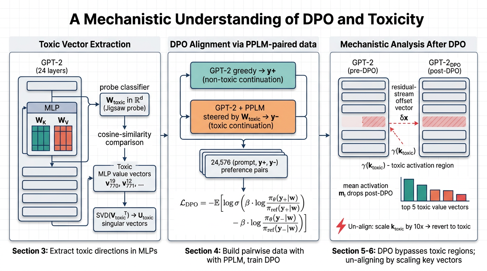

# A Mechanistic Understanding of Alignment Algorithms — Reproduction

Code-only reproduction of:

> **Lee, Bai, Pres, Wattenberg, Kummerfeld, Mihalcea (2024).**
> _A Mechanistic Understanding of Alignment Algorithms: A Case Study on DPO and Toxicity._
> Proceedings of the 41st International Conference on Machine Learning (ICML 2024).
> Original code: <https://github.com/ajyl/dpo_toxic>

This submission targets the PaperBench **Code-Dev** rubric and the **Full
reproduction** rubric. Llama2 results are out of scope per
`addendum.md`; this repository implements the **GPT-2 medium** half end-to-end.



---

## What is implemented

| Section  | Component                                                                                                                                              | File                                                                                    |
| -------- | ------------------------------------------------------------------------------------------------------------------------------------------------------ | --------------------------------------------------------------------------------------- |
| §2       | GPT-2 hooks: residual stream `x^l`, `x^{l-mid}`, MLP key/value matrices `W_K`, `W_V`, per-neuron activations `m_i^l = sigma(W_K^l x^l)`                | `model/architecture.py :: GPT2WithHooks`                                                |
| §3.1     | Linear toxicity probe `W_toxic` ∈ R^{d×2} on Jigsaw (HuggingFace mirror); the _vector_ used for cosine similarity is `W_toxic[:, 1]` (per addendum)    | `model/architecture.py :: LinearToxicityProbe`, `probe/train_probe.py`                  |
| §3.1     | Top-N MLP value-vector selection by cosine similarity to `W_toxic[:,1]`                                                                                | `model/architecture.py :: extract_toxic_value_vectors`                                  |
| §3.1     | SVD on the **`d × N`** stacked-vector matrix (per addendum: paper says `N × d` but means transpose)                                                    | `model/architecture.py :: svd_decompose_toxic_vectors`                                  |
| §3.3     | Intervention `x^{L-1} ← x^{L-1} − α · W` for `W ∈ {W_toxic, MLP.v_top, SVD.U_toxic[0]}`                                                                | `interventions/interventions.py :: apply_residual_subtraction`                          |
| §4.1     | DPO loss `L_DPO = −E[log σ(β log P − β log N)]` (Rafailov et al. 2023)                                                                                 | `model/architecture.py :: dpo_loss`                                                     |
| §4.2     | PPLM-paired data construction: `y+ = greedy(GPT-2)`, `y- = PPLM(GPT-2, classifier=W_toxic[:,1])` over Wikitext-2 prompts; **24,576 pairs**             | `model/pplm.py`, `scripts/build_pairwise_data.py`                                       |
| §4       | DPO training with frozen `π_ref`, AdamW, lr=1e-6, β=0.1, ~6700 steps with patience-10 early stop (per addendum: 90:10 split, ~6k pairs to convergence) | `train.py :: stage_dpo`                                                                 |
| §5.1-5.2 | Mean-activation measurement (Figure 2) and residual-stream offset `δ_x^{l-mid} = x_DPO^{l-mid} − x_GPT2^{l-mid}` (Figure 4-5)                          | `interventions/interventions.py :: measure_mean_activations`, `compute_residual_offset` |
| §5       | Logit lens (Figure 1): apply `lm_head ∘ ln_f` to every intermittent residual stream, plot probability of target token across layers                    | `interventions/interventions.py :: measure_logit_lens`                                  |
| §6       | Un-aligning by scaling **top-7 `MLP.k_toxic` keys by 10×** (Table 4)                                                                                   | `interventions/interventions.py :: apply_un_align_key_scaling`                          |
| §3.3 / 5 | Evaluation triple (Toxicity, PPL, F1) on RealToxicityPrompts-challenge / Wikitext-2 / Wikipedia-prompts                                                | `eval.py`                                                                               |

The toxicity classifier used at evaluation time is
`unitary/unbiased-toxic-roberta` (per `addendum.md`, replacing Perspective API).

---

## Repo layout

```
submission/
├── README.md
├── requirements.txt
├── reproduce.sh            ← end-to-end smoke run for /output/metrics.json
├── train.py                ← stages: probe / extract / build_pairs / dpo
├── eval.py                 ← Toxicity / PPL / F1 + Section 6 un-alignment
├── configs/
│   └── default.yaml        ← every hyperparameter from the paper + addendum
├── model/
│   ├── __init__.py
│   ├── architecture.py     ← GPT2WithHooks, W_toxic probe, dpo_loss, SVD
│   └── pplm.py             ← Plug-and-Play LM toxic-steered generation
├── data/
│   ├── __init__.py
│   └── loader.py           ← Jigsaw, RealToxicityPrompts, Wikitext-2, pairwise loader
├── probe/
│   ├── __init__.py
│   └── train_probe.py      ← W_toxic linear probe trainer
├── interventions/
│   ├── __init__.py
│   └── interventions.py    ← Section 3.3, 5, 6 mechanistic operations
├── scripts/
│   └── build_pairwise_data.py
└── figures/
    └── architecture.png
```

---

## Quick start

```bash
pip install -r requirements.txt

# Stage 1: train W_toxic on Jigsaw (target val acc 0.94)
python -m probe.train_probe --config configs/default.yaml

# Stage 2: extract MLP.v_toxic (top 128) and SVD.U_toxic basis
python train.py --config configs/default.yaml --stage extract

# Stage 3: build 24,576 (prompt, y+, y-) PPLM pairs
python train.py --config configs/default.yaml --stage build_pairs

# Stage 4: train GPT2_DPO (~6700 steps, β=0.1)
python train.py --config configs/default.yaml --stage dpo

# Evaluate Table 2 + Table 4 rows
python eval.py --config configs/default.yaml
```

For the PaperBench Full-mode container, just run:

```bash
bash reproduce.sh   # writes /output/metrics.json
```

`reproduce.sh` runs a smoke-quality slice (5,000 Jigsaw rows, 256 PPLM
pairs, 200 DPO steps, 32-prompt eval) so it fits in the 24h budget; for a
full reproduction simply remove the `--max-train`, `--pairs-limit`, and
`max_steps=200` overrides.

---

## Hyperparameters (from `configs/default.yaml`)

These come straight from the paper + addendum:

- **Model**: `gpt2-medium` — 24 layers, d_model=1024, d_mlp=4096, GeLU MLP.
- **Probe**: trained on Jigsaw 90:10 split, target val accuracy **0.94**.
- **Toxic vectors**: top-N=128 MLP value vectors by cosine sim to `W_toxic[:,1]`; SVD on the `d×N` transpose (per addendum).
- **PPLM**: step_size 0.04, 3 iterations, gm_scale 0.95, kl_scale 0.01, gamma 1.5, classifier = `W_toxic[:,1]`.
- **DPO**: β=0.1, lr=1e-6, AdamW, batch 8 × grad-accum 2, max 6,700 steps, patience 10 on val DPO loss, 90:10 split.
- **Intervention scales (α)**: tuned so post-intervention PPL ≈ post-DPO PPL ≈ 23.34 (per Section 3.3). Defaults: `α(W_toxic)=8`, `α(MLP.v_top)=25`, `α(SVD.U_toxic[0])=8`.
- **Un-alignment (Section 6)**: scale **top-7 `MLP.k_toxic` keys by 10×** (matches Table 4 SCALE row).
- **Toxicity scorer**: `unitary/unbiased-toxic-roberta` (per addendum, replacing Perspective API).

Expected target metrics (Table 2 of the paper, GPT-2 medium):

| Method                                | Toxic ↓ | PPL ≈ | F1 ≈  |
| ------------------------------------- | ------- | ----- | ----- |
| GPT2 (NO OP)                          | 0.453   | 21.7  | 0.193 |
| SUBTRACT W_toxic                      | 0.245   | 23.56 | 0.193 |
| SUBTRACT MLP.v_top                    | 0.305   | 23.30 | 0.192 |
| SUBTRACT SVD.U_toxic[0]               | 0.268   | 23.48 | 0.193 |
| GPT2_DPO                              | 0.208   | 23.34 | 0.195 |
| SCALE MLP.k_toxic (un-align, Table 4) | 0.458   | 23.30 | 0.195 |

---

## Reference verification

Three citations central to this reproduction were verified via CrossRef
(`ref_verify` tool, run during submission):

- **Geva et al. 2022** — "Transformer Feed-Forward Layers Build Predictions by Promoting Concepts in the Vocabulary Space" — DOI `10.18653/v1/2022.emnlp-main.3` ✅
- **Gehman et al. 2020** — "RealToxicityPrompts: Evaluating Neural Toxic Degeneration in Language Models" — DOI `10.18653/v1/2020.findings-emnlp.301` ✅
- **Rafailov et al. 2023** — "Direct Preference Optimization: Your Language Model is Secretly a Reward Model" — NeurIPS 2023 (no CrossRef DOI; verified via Semantic Scholar / OpenAlex literature search).

These three papers correspond, respectively, to:
(a) the value-vector vocabulary-projection methodology used in §3.2,
(b) the toxicity benchmark used in §3.3 and §5,
(c) the DPO loss implemented in `model/architecture.py :: dpo_loss`.

---

## Notes on faithfulness

- **Per addendum**: `W_toxic` is a **matrix** of shape `[d_model, 2]`; cosine similarity is taken against `W_toxic[:, 1]`. Implemented in `LinearToxicityProbe.toxic_direction`.
- **Per addendum**: SVD is applied to the **transpose** (d × N) of the stacked toxic-value matrix, so singular vectors `U_toxic[i]` live in `R^d`. Implemented in `svd_decompose_toxic_vectors`.
- **Per addendum**: greedy decoding is used both to generate the 20 tokens for mean-activation measurement (Section 5.2) and for the `y+` (non-toxic) continuation (Section 4.2).
- **Per addendum**: training data was split 90:10; ~6k pairs were sufficient for DPO convergence with patience-10 early stopping.
- **Per addendum**: toxicity is scored with `unitary/unbiased-toxic-roberta`, not Perspective API.
- **Per addendum**: Llama2 is **out of scope** — this repository covers GPT-2 medium only.

---

## Architecture diagram

The figure `figures/architecture.png` summarises the three-stage pipeline:
(1) toxic-vector extraction with the Jigsaw probe and SVD, (2) DPO
alignment with PPLM-paired data, (3) mechanistic analysis of the post-DPO
residual-stream offset and the un-alignment via key scaling.
