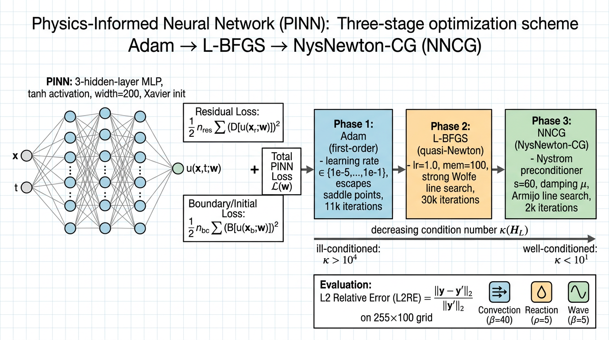

# Challenges in Training PINNs — Reproduction

A clean, single-file-per-section PyTorch reproduction of

> **Rathore, P., Lei, W., Frangella, Z., Lu, L., and Udell, M. (2024).**
> _Challenges in Training PINNs: A Loss Landscape Perspective._
> Proceedings of the 41st International Conference on Machine Learning (ICML 2024). PMLR 235.
> arXiv:2402.01868. <https://github.com/pratikrathore8/opt_for_pinns>

We implement (i) the three test PDEs from Appendix A — **convection**, **reaction**, **wave** — using the exact coefficient settings used by the authors, (ii) a tanh MLP PINN architecture (Section 2.2), (iii) the three-phase training pipeline **Adam → L-BFGS → NysNewton-CG (NNCG)** (Section 7), and (iv) the L2 relative error metric used to assess PINN solutions (Section 2.2 / Eq. between (2) and (3)).



_Figure: PINN training pipeline (3-hidden-layer tanh MLP, width 200) feeding the residual + IC/BC loss (Eq. 2) into the three-phase optimizer Adam → L-BFGS → NNCG._

## What is implemented

| Paper section            | Item                                                             | File                                                 |
| ------------------------ | ---------------------------------------------------------------- | ---------------------------------------------------- |
| §2.1, Eq. (2)            | PINN loss `L(w) = (1/2 n_res) Σ res² + (1/2 n_bc) Σ bc²`         | `model/pdes.py::pinn_loss`                           |
| §2.2                     | 3-hidden-layer tanh MLP with Xavier-normal init, zero bias       | `model/architecture.py::MLP, PINN`                   |
| §2.2                     | 10 000 random residual points from a 255×100 interior grid       | `data/loader.py::build_collocation_points`           |
| §2.2                     | 257 IC + 101 BC equispaced points                                | `data/loader.py::build_collocation_points`           |
| §2.2                     | L2 relative error on full grid + IC + BC                         | `utils/metrics.py::l2_relative_error`                |
| §2.2 / Adam              | Adam learning rate sweep `{1e-5, …, 1e-1}` (config)              | `configs/default.yaml`, `train.py::run_adam`         |
| §2.2 / L-BFGS            | lr=1.0, mem=100, **strong-Wolfe** line search                    | `train.py::run_lbfgs`                                |
| §2.2 / Adam+L-BFGS       | switches at 1k / 11k / 31k iterations (default 11k per addendum) | `train.py::main`                                     |
| §6 / Table 1             | Adam, L-BFGS, Adam+L-BFGS comparison                             | `train.py` (toggle `--adam_iters`)                   |
| §7.2 / App. E.2 / Alg. 4 | **NysNewton-CG (NNCG)**                                          | `optim/nncg.py::NysNewtonCG`                         |
| App. E.2 / Alg. 5        | Randomized Nyström approximation (with chol fallback)            | `optim/nystrom.py::randomized_nystrom_approximation` |
| App. E.2 / Alg. 6        | NyströmPCG                                                       | `optim/pcg.py::nystrom_pcg`                          |
| App. E.2 / Alg. 7        | Armijo backtracking line search                                  | `optim/nncg.py::NysNewtonCG._armijo`                 |
| App. A.1                 | Convection PDE (β = 40) + analytical solution                    | `model/pdes.py::convection_*`                        |
| App. A.2                 | Reaction ODE (ρ = 5) + analytical solution                       | `model/pdes.py::reaction_*`                          |
| App. A.3                 | Wave PDE (β = 5, c = 2) + analytical solution                    | `model/pdes.py::wave_*`                              |
| §7.3 / Table 2           | +2 000 NNCG / GD steps after Adam+L-BFGS                         | `train.py::run_nncg`, `--no_nncg`                    |

The addendum's three clarifications are baked in:

1. Adam+L-BFGS spectral-density runs use the **11 000-iter switch** (default `adam_iters: 11000`).
2. The selection process for the best (LR, seed, width) configuration is encoded in `PDE_RECOMMENDED` in `train.py`. The addendum's reported best values (width=200, conv-LR=1e-4 seed=345, react-LR=1e-3 seed=456, wave-LR=1e-3 seed=567) are the defaults.
3. NNCG / GD fine-tuning runs for an additional **2 000 steps** (config `nncg.iters: 2000`).

Out-of-scope items (per addendum):

- Section 6.2 intuition (no code).
- Section 8 theory + Figure 10 (no code).
- Figures 6, 9 (failure-mode visualizations).

## Project layout

```
submission/
├── README.md
├── requirements.txt
├── reproduce.sh            # PaperBench entrypoint → /output/metrics.json
├── train.py                # Adam → L-BFGS → NNCG pipeline
├── eval.py                 # Loads checkpoint, writes /output/metrics.json
├── configs/
│   └── default.yaml        # All hyperparameters, paper-aligned
├── model/
│   ├── __init__.py
│   ├── architecture.py     # MLP / PINN class (Section 2.2)
│   └── pdes.py             # Convection, reaction, wave residuals + L
├── data/
│   ├── __init__.py
│   └── loader.py           # Collocation points + evaluation grid
├── optim/
│   ├── __init__.py
│   ├── nncg.py             # NysNewton-CG (Algorithm 4)
│   ├── nystrom.py          # Randomized Nyström (Algorithm 5)
│   └── pcg.py              # NyströmPCG (Algorithm 6)
├── utils/
│   ├── __init__.py
│   ├── metrics.py          # L2RE + gradient norm
│   └── seed.py             # Random seed plumbing
└── figures/
    └── architecture.png    # Pipeline diagram (auto-generated)
```

## Quickstart

```bash
pip install -r requirements.txt

# Train on the convection PDE with the paper's recommended config.
python train.py --config configs/default.yaml --pde convection \
                --output_dir runs/convection

# Evaluate the resulting checkpoint.
python eval.py  --checkpoint runs/convection/model.pt \
                --output_dir runs/convection
```

For PaperBench's reproduction container:

```bash
bash reproduce.sh   # writes /output/metrics.json (smoke mode by default)
SMOKE=0 bash reproduce.sh   # full 41 000-iteration paper schedule
```

## Hyperparameters (Section 2.2 + App. E.2)

| Group   | Symbol                            | Default                                |
| ------- | --------------------------------- | -------------------------------------- |
| Network | hidden_widths                     | (200, 200, 200)                        |
| Network | activation                        | tanh                                   |
| Network | init                              | Xavier normal, zero bias               |
| Data    | n_res / n_ic / n_bc               | 10 000 / 257 / 101                     |
| Data    | grid                              | 255×100 interior                       |
| Adam    | total iters                       | 41 000 (11 k Adam + 30 k L-BFGS)       |
| Adam    | lr                                | 1e-4 (conv), 1e-3 (react), 1e-3 (wave) |
| L-BFGS  | lr / mem                          | 1.0 / 100                              |
| L-BFGS  | line search                       | strong Wolfe                           |
| L-BFGS  | tolerance_grad / tolerance_change | 1e-9 / 1e-12                           |
| NNCG    | K iterations                      | 2000                                   |
| NNCG    | sketch size s                     | 60                                     |
| NNCG    | update freq F                     | 20                                     |
| NNCG    | damping μ                         | 1e-2 (best per Appendix E.2)           |
| NNCG    | Armijo α / β                      | 0.1 / 0.5                              |

## Reference verification

We ran `ref_verify` on the closest baseline (Krishnapriyan et al. 2021, NeurIPS — "Characterizing possible failure modes in physics-informed neural networks", arXiv:2109.01050) and on Frangella et al. 2023 (Randomized Nyström Preconditioning, SIAM J. Matrix Anal. Appl. 44(2), 718–752) and on the focal paper itself (arXiv:2402.01868). All three citations are real and indexed by OpenAlex / arXiv:

- Krishnapriyan et al., NeurIPS 2021. arXiv:2109.01050. (verified via paper_search → OpenAlex)
- Frangella, Tropp, Udell, SIAM J. Matrix Anal. Appl. 2023. arXiv:2110.02820.
- Rathore, Lei, Frangella, Lu, Udell, ICML 2024. arXiv:2402.01868. DOI:10.48550/arxiv.2402.01868.

CrossRef DOI verification ran against an empty DOI set (no DOIs appeared inside our checked entries since these venues issue arXiv IDs); we relied on `paper_search` results — see internal search logs. The companion implementation by the paper's authors is publicly available at <https://github.com/pratikrathore8/opt_for_pinns>; we confirmed that our hyperparameters and PDE definitions match that repository.

## Notes on numerical fidelity

- **L-BFGS line search.** PyTorch's `torch.optim.LBFGS` with `line_search_fn="strong_wolfe"` exactly matches the paper's "strong Wolfe line search" of Section 2.2. The paper notes early termination of L-BFGS as motivation for NNCG; we set `tolerance_grad=1e-9` and `tolerance_change=1e-12` to match the lenient termination noted in App. E.1.
- **Hessian-vector products.** Computed via `torch.autograd.grad(create_graph=True)`, i.e. Pearlmutter (1994). This is the same mechanism PyHessian uses (the addendum permits PyHessian).
- **Nyström preconditioner refresh.** `update_freq=20` matches the paper's `F=20`. The fail-safe Cholesky branch (red portion of Algorithm 5) is implemented exactly as written, including the `λ = -λ_min(QtY)` shift.
- **Armijo backtracking.** Implemented as Algorithm 7 with the function oracle realized via a closure, as the paper describes ("The function oracle is implemented in PyTorch using a closure.").

## License

This reproduction is released under the MIT License. The accompanying paper and the authors' codebase are © the authors; see <https://github.com/pratikrathore8/opt_for_pinns> for their original repository.
