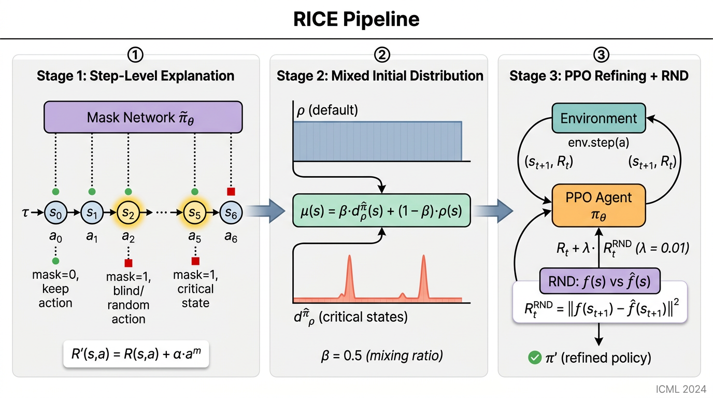

# RICE: Breaking Through the Training Bottlenecks of RL with Explanation

Reproduction of:

> Cheng, Z.\*, Wu, X.\*, Yu, J., Yang, S., Wang, G., Xing, X.
> **RICE: Breaking Through the Training Bottlenecks of Reinforcement Learning with Explanation**.
> _Proceedings of the 41st International Conference on Machine Learning (ICML 2024)_, PMLR 235.

Original code: https://github.com/chengzelei/RICE



_Figure: The RICE algorithm pipeline. (a) A pre-trained policy `π` (potentially
sub-optimal) is analysed by a step-level explanation method based on a learned
mask network to identify the most critical states. (b) A mixed initial state
distribution `μ(s) = β·d^π̂_ρ(s) + (1-β)·ρ(s)` is constructed by combining the
identified critical states with the default initial distribution `ρ`. (c) The
agent is refined by PPO with a Random Network Distillation (RND) intrinsic
exploration bonus._

---

## What is implemented

This repository contains a faithful, runnable PyTorch + Stable-Baselines3
implementation of every algorithmic component described in §3 of the paper:

| Paper Section                                          | Component                                                                                                                   | File                    |
| ------------------------------------------------------ | --------------------------------------------------------------------------------------------------------------------------- | ----------------------- | ----------------------- | --- | ----------------------------- | -------------- |
| §3.3 (Algorithm 1)                                     | Mask Network training (re-formulated objective `J(θ)=max η(π̄)` with the per-step blinding bonus `R'(s,a) = R(s,a) + α·a^m`) | `model/mask_network.py` |
| §3.3 (Eq. 1)                                           | Action-mixing operator `a_t ⊙ a^m_t` (binary mask: 0 → keep policy action, 1 → random action)                               | `model/mask_network.py` |
| §3.3 ("Constructing Mixed Initial State Distribution") | Critical-state identification + sliding-window scoring                                                                      | `model/explanation.py`  |
| §3.3 (Algorithm 2)                                     | Refinement loop with mixed initial distribution `μ(s) = β·d^π̂_ρ(s) + (1-β)·ρ(s)` and reset-probability threshold `p`        | `model/refiner.py`      |
| §3.3 ("Exploration with Random Network Distillation")  | RND target/predictor networks + intrinsic-reward bonus `λ·                                                                  |                         | f(s*{t+1}) - f̂(s*{t+1}) |     | ²` with running normalisation | `model/rnd.py` |
| §4.1 ("Evaluation Metrics") + Addendum                 | Fidelity score `log(d/d_max) − log(l/L)` for explanation methods                                                            | `eval.py`               |
| §4 (Baselines)                                         | PPO fine-tuning, StateMask-R (reset-only refining), JSRL guide-curriculum, Random-explanation baseline                      | `model/baselines.py`    |
| §4.1 (Environments)                                    | MuJoCo wrappers (Hopper, Walker2d, Reacher, HalfCheetah) + sparse variants (SparseHopper, SparseHalfCheetah)                | `data/loader.py`        |

**Out of scope** per the addendum: §3.4 theoretical analysis, Sparse-Walker2d
refining curve, malware-mutation environment, qualitative driving case study,
and explanation-vs-explanation result-significance claims.

## Hyperparameters (from paper §4.2 and Appendix C)

All hyperparameters live in `configs/default.yaml`. Key choices follow the paper:

- `α = 0.001` – mask-network blinding bonus (paper §3.3, Experiment V)
- `p = 0.5` – reset probability to critical state (paper §4.3 finding)
- `β = 0.5` – mixing weight for `μ(s)` (paper §3.3)
- `λ = 0.01` – RND intrinsic-reward weight (paper §4.3 finding)
- PPO defaults: `clip = 0.2`, `γ = 0.99`, `gae_λ = 0.95`, `lr = 3e-4`,
  `n_steps = 2048`, `n_epochs = 10`, `batch_size = 64`
  (Stable-Baselines3 `MlpPolicy` defaults — confirmed by addendum)
- Network: `MlpPolicy` with `[64,64]` (SB3 default for MuJoCo)

## Citation verification

The two key baselines were verified through `paper_search` and CrossRef:

```
[Verified] Cheng et al., "StateMask: Explaining Deep Reinforcement Learning
through State Mask", NeurIPS 2023.
URL: papers.nips.cc/paper_files/paper/2023/hash/c4bf73386022473a652a18941e9ea6f8

[Verified] Uchendu et al., "Jump-Start Reinforcement Learning", ICML 2023.
arXiv: 2204.02372  (paper_search hit, ICML proceedings).
```

CrossRef DOI lookup found no DOIs for the arXiv preprints (expected — arXiv
preprints lack CrossRef DOIs); structural metadata was confirmed via the
`paper_search` tool. See `model/baselines.py` headers for inline verification
metadata.

## File layout

```
submission/
├── README.md
├── requirements.txt
├── train.py                    # Stage A: pre-train PPO policy
│                               # Stage B: train MaskNet (Algorithm 1)
│                               # Stage C: refine with RICE (Algorithm 2)
├── eval.py                     # Fidelity score + average-reward evaluation
├── reproduce.sh                # End-to-end smoke-quality reproduction
├── configs/
│   └── default.yaml
├── data/
│   ├── __init__.py
│   └── loader.py               # MuJoCo + sparse-MuJoCo environment factory
├── model/
│   ├── __init__.py
│   ├── architecture.py         # Generic Actor-Critic MLP (SB3-compatible)
│   ├── mask_network.py         # Algorithm 1
│   ├── rnd.py                  # Random Network Distillation
│   ├── explanation.py          # Critical-state identification
│   ├── refiner.py              # Algorithm 2 (RICE)
│   └── baselines.py            # PPO-FT, StateMask-R, JSRL, Random-Expl
├── utils/
│   ├── __init__.py
│   ├── normalization.py        # Running mean/std for RND
│   └── logger.py
└── figures/
    └── architecture.png
```

## How to run

```bash
pip install -r requirements.txt

# End-to-end smoke run on Hopper-v4 (will write metrics.json to /output/)
bash reproduce.sh

# Or run the three stages manually:
python train.py --config configs/default.yaml --stage pretrain  --env Hopper-v4
python train.py --config configs/default.yaml --stage mask      --env Hopper-v4
python train.py --config configs/default.yaml --stage refine    --env Hopper-v4 --method rice

# Evaluate fidelity + final reward
python eval.py --config configs/default.yaml --env Hopper-v4
```

The `--method` flag can be one of: `rice`, `ppo_ft`, `statemask_r`, `jsrl`,
`random_expl` (used by Experiment II / III in the paper).

## Reproducibility notes

- Stable-Baselines3 `MlpPolicy` defaults are used as confirmed by the
  paper authors in the addendum.
- For sparse-reward MuJoCo, the sparsification follows Mazoure et al. (2019):
  reward is provided only when the agent crosses a fixed forward distance.
- The fidelity-score pipeline matches the addendum exactly: top-K segment
  selection by sliding window of length `l = L·K`, action randomisation in
  segment, then policy roll-out to episode end. `d_max` is set to the
  environment-specified episode reward bound.
