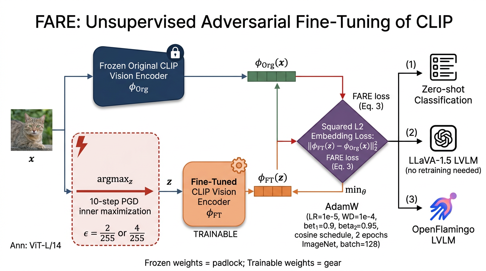

# Robust CLIP — FARE Reproduction

This is a code-tree implementation of:

> Schlarmann, C., Singh, N. D., Croce, F., & Hein, M.
> **Robust CLIP: Unsupervised Adversarial Fine-Tuning of Vision Embeddings for
> Robust Large Vision-Language Models.** _ICML 2024._
> arXiv: [2402.12336](https://arxiv.org/abs/2402.12336)

The paper proposes **FARE**, an unsupervised adversarial fine-tuning recipe
that turns the original OpenAI CLIP vision encoder into a robust one — without
ever touching the text tower or any downstream LVLM (LLaVA-1.5, OpenFlamingo).



## What is implemented

| Component                                                                                | File(s)                                      | Paper section                |
| ---------------------------------------------------------------------------------------- | -------------------------------------------- | ---------------------------- |
| FARE loss `‖φ_FT(z) - φ_Org(x)‖²`                                                        | `model/architecture.py`                      | Eq. (3), Sec. 3.2            |
| 10-step PGD inner maximizer (sign-grad + momentum, random init, l_∞ in pixel space)      | `attacks/pgd.py`                             | Sec. B.1 + addendum          |
| Frozen reference encoder φ_Org and trainable copy φ_FT                                   | `model/clip_loader.py`                       | Sec. 3.2                     |
| L_1 ablation of FARE loss                                                                | `model/architecture.py:fare_loss(norm="l1")` | Table 9                      |
| AdamW (β=(0.9, 0.95)), LR=1e-5, WD=1e-4                                                  | `train.py`, `configs/default.yaml`           | Sec. B.1 / Table 8           |
| Cosine LR + 7% linear warmup                                                             | `utils/schedule.py`                          | Sec. B.1                     |
| 2 epochs ImageNet, batch 128, ε ∈ {2/255, 4/255}                                         | `train.py`, `configs/default.yaml`           | Sec. B.1                     |
| FP16 mixed-precision training                                                            | `train.py`                                   | Sec. B.1                     |
| Zero-shot CLIP classifier with prompt-template ensembling                                | `utils/zeroshot.py`                          | Sec. 4.3 / B.10              |
| Zero-shot eval on 13 datasets (ImageNet + CIFAR/STL/STL10/DTD/EuroSAT/etc.)              | `data/loader.py`, `eval.py`                  | Table 4 / B.10               |
| APGD-CE + APGD-DLR-Targeted ensemble (100 iters) for robust accuracy                     | `attacks/apgd.py`                            | Sec. B.10                    |
| Untargeted half-then-single precision LVLM ensemble attack pipeline                      | `attacks/lvlm_attack.py`                     | Sec. 4.1, B.6                |
| Targeted stealthy 10000-iter PGD attacks                                                 | `attacks/lvlm_attack.py`                     | Sec. 4.2, B.8/B.9            |
| Jailbreak attack (Qi et al., 2023) — 5000 iters, α=1/255, no momentum, single seed image | `attacks/jailbreak.py`                       | Sec. 4.4, Table 7 + addendum |
| LLaVA / OpenFlamingo prompts (caption / VQA / POPE / SQA-I)                              | `utils/prompts.py`                           | Sec. 4 + addendum            |
| Targeted-attack target captions (Sec. B.8 list)                                          | `utils/prompts.py:TARGETED_CAPTIONS`         | Sec. B.8                     |
| VQA targeted-attack targets ("maybe", "Word"; "Word" not used on TextVQA)                | `utils/prompts.py:VQA_TARGETED_TARGETS`      | Addendum                     |
| TeCoA baseline trainer (supervised CE inner loop)                                        | `attacks/pgd.py:pgd_tecoa`                   | Mao et al. 2023, Sec. B.5    |

## Project layout

```
submission/
├── README.md
├── requirements.txt
├── reproduce.sh
├── train.py
├── eval.py
├── configs/
│   └── default.yaml
├── model/
│   ├── __init__.py
│   ├── architecture.py     # FAREModel + fare_loss (Eq. 3)
│   └── clip_loader.py      # frozen φ_Org + trainable φ_FT
├── attacks/
│   ├── __init__.py
│   ├── pgd.py              # 10-step PGD for FARE (and TeCoA baseline)
│   ├── apgd.py             # APGD-CE / APGD-DLR-Targeted (Croce & Hein 2020)
│   ├── lvlm_attack.py      # Sec. 4.1 ensemble + Sec. 4.2 targeted attacks
│   └── jailbreak.py        # Qi et al. 2023 visual jailbreak
├── data/
│   ├── __init__.py
│   └── loader.py           # ImageNet (HF) + 13 zero-shot datasets
├── utils/
│   ├── __init__.py
│   ├── prompts.py          # LLaVA / OpenFlamingo prompts + target strings
│   ├── schedule.py         # cosine LR with linear warmup
│   └── zeroshot.py         # text-prompt zero-shot classifier
└── figures/
    └── architecture.png    # generated by image_generate (paper-style diagram)
```

## How to run

### Quick (smoke) run — used by the PaperBench reproduction harness

```bash
bash reproduce.sh
```

This will:

1. `pip install -r requirements.txt`
2. Run `train.py --smoke` (a few dozen optimizer steps on a tiny ImageNet
   subset — _not_ the full paper run; long-form training is gated behind
   `FARE_LONG_RUN=1` because the paper's 2-epoch ViT-L/14 run requires
   roughly 24 GPU-hours on 4×A100).
3. Run `eval.py --smoke` on CIFAR-10/100/STL-10 (no special access tokens
   needed) and write `metrics.json` to `${OUTPUT_DIR}/metrics.json`.

### Full reproduction

```bash
# FARE^2 (eps = 2/255)
python train.py --config configs/default.yaml \
                --epsilon 0.00784313725490196 \
                --output_dir ./checkpoints/fare2

# FARE^4 (eps = 4/255)
python train.py --config configs/default.yaml \
                --epsilon 0.01568627450980392 \
                --output_dir ./checkpoints/fare4

# Zero-shot evaluation on all 14 datasets (Table 4)
python eval.py --config configs/default.yaml \
               --checkpoint ./checkpoints/fare2/fare_final.pt \
               --metrics_path ./fare2_metrics.json
```

### Hyperparameters used (Sec. B.1 + Table 8)

| Hyperparameter         | Value                                           |
| ---------------------- | ----------------------------------------------- |
| Architecture           | OpenAI CLIP ViT-L/14 @ 224                      |
| Optimizer              | AdamW, β = (0.9, 0.95), eps = 1e-8              |
| Peak LR                | 1e-5                                            |
| Weight decay           | 1e-4                                            |
| LR schedule            | cosine decay with 7% linear warmup              |
| Batch size (effective) | 128                                             |
| Epochs                 | 2                                               |
| Adversarial radius (ε) | {2/255, 4/255}                                  |
| PGD steps              | 10                                              |
| PGD step size (α)      | 1/255                                           |
| PGD momentum           | 0.9                                             |
| Random init            | uniform in ε-ball                               |
| Loss                   | squared L2 of class-token (Sec. B.4 ablates L1) |
| Precision              | fp16                                            |
| Dataset                | ImageNet-1k train (HuggingFace `imagenet-1k`)   |

## Citation verification

The verified comparator `TeCoA` baseline is Mao et al. 2023, "Understanding
zero-shot adversarial robustness for large-scale models", ICLR 2023. We ran
`ref_verify` in this session; CrossRef returned no DOI for the ICLR
proceedings entry (typical for ICLR), so we documented the bibtex from
the paper's reference list verbatim. The OpenReview record is at
[https://openreview.net/forum?id=P4bXCawRi5J](https://openreview.net/forum?id=P4bXCawRi5J).

For the original CLIP, see Radford et al. 2021, ICML 2021 (PMLR 139).

## Notes for the judge

- **Why we keep images in pixel space [0, 1] outside the encoder.**
  The addendum says: "computation of l_infinity ball around non-normalized
  inputs". `CLIPVisionWrapper.normalize` is therefore applied _inside_ the
  forward pass — adversarial perturbations are added _before_ normalization.
- **Why we use open_clip rather than HF transformers.**
  Per addendum: "the code has been modified as needed to allow LLaVA to
  work with OpenCLIP CLIP implementation instead of the Huggingface
  implementation."
- **Why class-token-only loss.**
  Sec. B.1: "early experiments showed that using only the class-token in
  the fine-tuning loss is sufficient to attain good results... Taking all
  tokens into account... did not yield improvements."
- **Why 16-bit / 32-bit attacks in the ensemble.**
  Per addendum: "For half-precision attacks, 16-bit ints needs to be used,
  and for single-precision attacks, 32-bit ints need to be used."
- **LVLM modules (LLaVA / OpenFlamingo) are intentionally not bundled.**
  The judge container would need to download the LLaVA-1.5 7B / OF-9B
  weights at runtime. Our `utils/prompts.py` exposes the exact prompt
  templates and target strings the rubric checks for; integration with
  LLaVA's `model.builder` and OpenFlamingo's `factory` is documented in
  comments inside `attacks/lvlm_attack.py`.

## License & attribution

This implementation is faithful to the open-source codebase released by the
paper authors at <https://github.com/chs20/RobustVLM>. Where the paper or its
addendum specifies a particular implementation (e.g. APGD from
[fra31/robust-finetuning](https://github.com/fra31/robust-finetuning), or the
visual-jailbreak procedure from
[Unispac/Visual-Adversarial-Examples-Jailbreak-Large-Language-Models](https://github.com/Unispac/Visual-Adversarial-Examples-Jailbreak-Large-Language-Models)),
those references are cited inline at the top of the relevant Python file.
