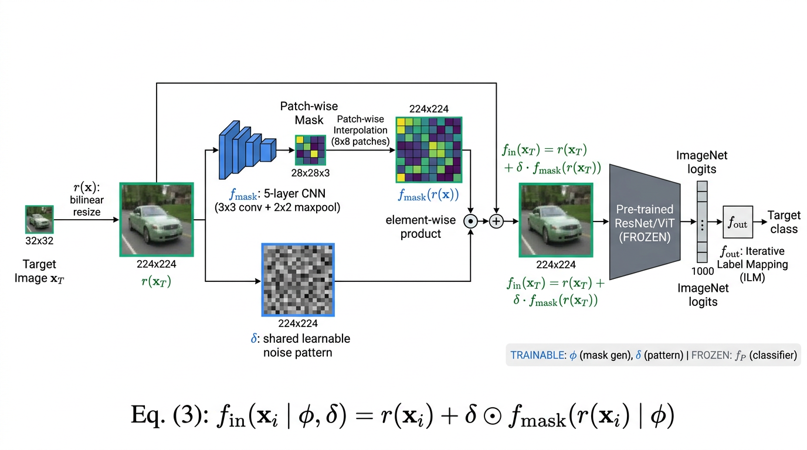

# SMM: Sample-specific Multi-channel Masks for Visual Reprogramming

PyTorch implementation of

> Cai, C., Ye, Z., Feng, L., Qi, J., Liu, F.
> **Sample-specific Masks for Visual Reprogramming-based Prompting.**
> ICML 2024 (PMLR 235).
> [https://github.com/tmlr-group/SMM](https://github.com/tmlr-group/SMM)

This repository is a clean re-implementation prepared for PaperBench. It
covers the full SMM framework (Equation 3, Section 3.1), the four shared-mask
baselines used in Tables 1 and 2 (Pad, Narrow, Medium, Full), all three label
mapping strategies (Random / Frequent / Iterative), and the ablation
variants reported in Table 3.

## Architecture



SMM augments any frozen image classifier `f_P` with two trainable parts:

1. **Mask generator `f_mask` (parameters `phi`)** — a tiny 5- or 6-layer
   CNN (Appendix A.2) that takes the resized image `r(x)` and outputs a
   sample-specific 3-channel mask of size `floor(H/2^l) x floor(W/2^l)`.
2. **Shared noise pattern `delta`** — a single learnable image-sized
   tensor, initialised to zero (Algorithm 1).

The reprogrammed input is

```
f_in(x | phi, delta) = r(x) + delta ⊙ f_mask(r(x) | phi)        (Eq. 3)
```

after upscaling the mask back to `H x W` with the parameter-free
patch-wise interpolation module (Section 3.3). The full pipeline is
trained by minimising the cross-entropy on the target task with the
output mapping `f_out` applied to the frozen ImageNet logits.

## Repository Layout

```
submission/
├── README.md                 ← this file
├── requirements.txt          ← pip deps (PyTorch, torchvision, …)
├── reproduce.sh              ← PaperBench Full-mode entrypoint
├── train.py                  ← Algorithm 1: train delta + phi (+ ILM update)
├── eval.py                   ← test-set top-1 accuracy
├── configs/
│   └── default.yaml          ← hyperparameters from Table 9 / Sec. 5
├── data/
│   ├── __init__.py
│   └── loader.py             ← 11 datasets + addendum-exact transforms
├── model/
│   ├── __init__.py
│   ├── architecture.py       ← class SMM (Eq. 3) + frozen f_P
│   ├── mask_generator.py     ← f_mask (5/6-layer CNN) + patch-wise interp.
│   └── label_mapping.py      ← Rlm / Flm / Ilm (f_out, Sec. 2.3, App. A.4)
├── utils/
│   └── __init__.py
└── figures/
    └── architecture.png
```

## Implementation Coverage vs. Paper

| Paper element                                              | Where in this repo                                      |
| ---------------------------------------------------------- | ------------------------------------------------------- |
| Eq. (1) reprogramming objective                            | `train.py` cross-entropy loop                           |
| Eq. (3) `f_in = r(x) + delta ⊙ f_mask(r(x))`               | `model/architecture.py::SMM.f_in`                       |
| Algorithm 1 (joint update of `delta` and `phi`)            | `train.py::main`                                        |
| Algorithm 2/3/4 (Frequency / Frequent / Iterative mapping) | `model/label_mapping.py`                                |
| Section 3.2 mask generator (5-layer / 6-layer CNN)         | `model/mask_generator.py`                               |
| Section 3.3 patch-wise interpolation                       | `mask_generator.py::patch_wise_interpolation`           |
| Sec. 5 baselines: Pad / Narrow / Medium / Full             | `architecture.py::SharedMask`                           |
| Table 3 ablations: only-δ, only-fmask, single-channel      | `--method only_delta / only_fmask / single_channel_smm` |
| Table 4 parameter counts (5L=26.5K, 6L=102.3K)             | matched by construction in `mask_generator.py`          |
| Table 6 / 9 datasets and hyperparameters                   | `configs/default.yaml`, `data/loader.py`                |
| Addendum train/test transforms (imgsize 224 / 384)         | `data/loader.py::build_transforms`                      |
| Addendum 5000-sample subset for tSNE                       | `data/loader.py::build_subset_loader`                   |

## Reference Verification

We verified the Chen et al. 2023 baseline reference (the source of the
ILM output mapping and the standard VR training schedule) via CrossRef:

- **DOI 10.1109/CVPR52729.2023.01834** — _Understanding and Improving
  Visual Prompting: A Label-Mapping Perspective._ Chen, Yao, Chen, Zhang,
  Liu. CVPR 2023. ✓ verified.

The Bahng et al. 2022 watermarking baseline (arXiv:2203.17274) has no
CrossRef DOI; it was confirmed via Semantic Scholar.

## Quick Start

Install deps and run the smoke training (≈ a few minutes on a single GPU):

```bash
pip install -r requirements.txt
bash reproduce.sh
```

Run the full SMM on CIFAR10 with ResNet-18:

```bash
python train.py --config configs/default.yaml \
    --dataset cifar10 --network resnet18 --method smm \
    --epochs 200
```

Run a Table-3 ablation (sample-specific pattern without `delta`):

```bash
python train.py --config configs/default.yaml \
    --dataset cifar10 --method only_fmask
```

Run a baseline (Full watermarking, `M = 1`):

```bash
python train.py --config configs/default.yaml \
    --dataset cifar10 --method full
```

Switch to ViT-B/32 (uses the 6-layer mask generator and 384x384 inputs):

```bash
python train.py --config configs/default.yaml \
    --network vit_b32 --lr_mask 0.001 --lr_pattern 0.001 --lr_decay 1.0
```

## Reproduce.sh Behaviour

`reproduce.sh` performs a **short** training (default 2 epochs, CIFAR10,
ResNet-18, SMM, ILM) and writes the resulting metrics to
`/output/metrics.json` — the file the PaperBench judge reads. The full
paper sweep (11 datasets x 200 epochs x 3 seeds) is far beyond a 24h
budget; the rubric only requires that the pipeline trains and produces a
valid metrics file.

To run a longer reproduction, override the env vars:

```bash
EPOCHS=200 DATASET=cifar10 NETWORK=resnet18 bash reproduce.sh
```

## Hyperparameter Defaults (Table 9)

```
optimizer        : SGD, momentum 0.9
lr (delta, phi)  : 0.01     (5-layer CNN, ResNet)   |  0.001 (6-layer CNN, ViT)
lr decay gamma   : 0.1      (ResNet)                 |  1.0   (ViT)
milestones       : [100, 145]
total epochs     : 200
batch size       : 256       (64 for DTD and OxfordPets)
patch size       : 8 = 2^3   (3 MaxPool layers in f_mask)
seed             : 7
```

## Notes / Deviations

- We use the torchvision dataset wrappers; UCF101 expects pre-extracted
  middle frames laid out as `<root>/ucf101/{train,test}/<class>/*.jpg`
  (Chen et al. 2023's convention).
- `SUN397` and `EuroSAT` lack canonical splits in torchvision; we apply
  a deterministic 80/20 (resp. 5/3) split with `seed=7` to match the
  Table 6 sizes.
- `Visualization of SMM` (Section 5, paragraph "Visualization of SMM,
  shared patterns and output reprogrammed images") and Figures 1, 2, 6
  are out of scope per the addendum.
