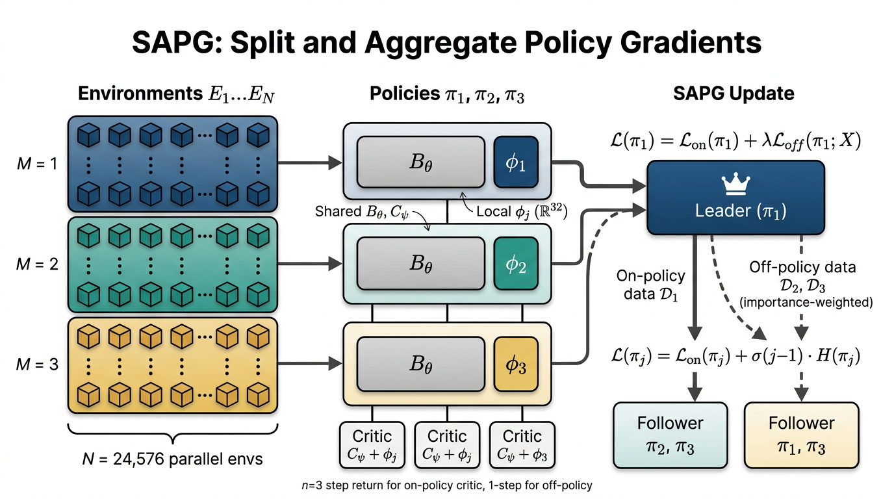

# SAPG: Split and Aggregate Policy Gradients — Code Submission

This codebase reimplements **SAPG** (Singla, Agarwal & Pathak, _ICML 2024_),
an on-policy reinforcement-learning algorithm for the _massively-parallel
simulation_ regime (e.g. IsaacGym with N = 24 576 envs).

> Paper: <https://sapg-rl.github.io>
> arXiv: <https://arxiv.org/abs/2407.20230>



_Architecture diagram of SAPG (generated via Gemini image*generate).
Each of M policies sees a contiguous block of N/M environments, all
share a backbone B*θ / C_ψ, and are conditioned on a small per-policy
latent φ_j. The leader (π₁) aggregates importance-sampled off-policy
data from the followers; followers train with on-policy PPO + an
optional entropy-diversity bonus._

---

## What is implemented

### Core algorithm (Algorithm 1 in the paper)

- **Splitting**: N parallel envs split into M contiguous blocks of N/M envs each
  (`SAPGRolloutStorage` in `data/loader.py`).
- **Per-policy data buffers** D₁ … D_M (one `RolloutBuffer` per policy).
- **Leader-follower aggregation** (§4.3): leader π₁ uses on-policy data
  from D₁ + IS-corrected off-policy data from D₂ … D_M; followers train
  with vanilla PPO. Selectable via `cfg.sapg.variant`.
- **Symmetric aggregation** (§4.2): each policy uses data from all others.
- **Off-policy subsampling** (§4.3): match |off| = |on| in the leader's
  minibatch (toggle: `cfg.sapg.subsample_off_policy`).
- **Latent conditioning** (§4.4 + addendum): shared backbone + per-policy
  φ*j ∈ ℝ³² (AllegroKuka) or ℝ¹⁶ (ShadowHand / AllegroHand). The same
  φ_j is used by both actor (B*θ) and critic (C_ψ) per the addendum.
- **Entropy diversity** (§4.5): follower j gets `σ·j · H(π_j)` added to
  its loss; leader has none. Each policy carries its own `log_std` vector
  so they can drift apart in entropy (App. B Note).

### Losses (`sapg/losses.py`)

| Eq. in paper                                           | Function                        |
| ------------------------------------------------------ | ------------------------------- |
| Eq. 2 — PPO clipped surrogate                          | `on_policy_loss`                |
| Eq. 3 — IS-clipped off-policy surrogate (μ correction) | `off_policy_loss`               |
| Eq. 4 — combined L_on + λ·L_off                        | `sapg_combined_actor_loss`      |
| Eq. 5 — n-step return target (n=3)                     | `data.loader.n_step_return`     |
| Eq. 6 — 1-step off-policy bootstrap                    | inside `off_policy_critic_loss` |
| Eqs. 7-9 — combined critic loss                        | `sapg_combined_critic_loss`     |
| App. B — bounds loss (1e-4)                            | `bounds_loss`                   |

### PPO bookkeeping (`sapg/algorithm.py`)

- GAE(γ, τ) with γ = 0.99, τ = 0.95 (Table 2).
- Adaptive learning rate gated on approx-KL ≷ 0.016 (Table 2).
- Grad-norm clipping = 1.0.
- Mini-batch SGD with `mini_epochs` ∈ {2, 5} per task (Tables 2-4).
- Adam optimizer over θ ∪ ψ ∪ {φ_j}.

### Architecture (`model/`)

- **AllegroKuka** (`configs/default.yaml`): observation MLP 768→512→256
  (ELU) → LSTM(1 layer, 768) → mean head + per-policy log_std.
- **ShadowHand** (`configs/shadow_hand.yaml`): MLP 512→512→256→128 (ELU).
- **AllegroHand** (`configs/allegro_hand.yaml`): MLP 512→256→128 (ELU).
- Activations exactly as in App. B.1-B.3 (ELU, Clevert et al., 2016).

### Diversity diagnostics (§6.4, Figs. 7-8 — `utils/diversity.py`)

- `pca_reconstruction_curve` — top-k PCA reconstruction error vs k
- `mlp_reconstruction_error` — 2-layer ReLU MLP, Adam defaults, L2 loss,
  trained on 400k transitions per the addendum.

### Configs (`configs/`)

All hyperparameters from Tables 2, 3 and 4 of the paper are present:
γ, τ, lr (1e-4 vs 5e-4 by task), KL threshold 0.016, grad norm 1.0,
PPO ε ∈ {0.1, 0.2}, mini-batch factor 4, critic coef λ′ = 4.0, horizon
∈ {16, 8}, bounds-loss coef 1e-4, mini-epochs ∈ {2, 5}, n-step = 3,
M = 6 policies, N = 24 576 envs, φ_j ∈ {ℝ¹⁶, ℝ³²}.

---

## Files

```
submission/
├── README.md                ← you are here
├── requirements.txt
├── reproduce.sh             ← runs a smoke train + eval, writes /output/metrics.json
├── train.py                 ← Algorithm 1 entrypoint
├── eval.py                  ← deterministic policy rollout, writes metrics
├── configs/
│   ├── default.yaml         ← AllegroKuka (Table 2)
│   ├── shadow_hand.yaml     ← ShadowHand   (Table 3)
│   └── allegro_hand.yaml    ← AllegroHand  (Table 4)
├── model/
│   ├── __init__.py
│   ├── architecture.py      ← SAPGActor, SAPGCritic, SAPGPolicySet
│   └── backbones.py         ← MLPBackbone, LSTMBackbone
├── data/
│   ├── __init__.py
│   └── loader.py            ← env wrapper, RolloutBuffer, GAE, n-step targets
├── sapg/
│   ├── __init__.py
│   ├── losses.py            ← Eqs. 2-9
│   └── algorithm.py         ← rollout collection, mini-batch update
├── utils/
│   ├── __init__.py
│   ├── config.py
│   └── diversity.py         ← Sec. 6.4 PCA / MLP diagnostics
└── figures/
    └── architecture.png     ← generated diagram
```

---

## How to run

### Smoke run (CPU/GPU, no IsaacGym needed)

```bash
pip install -r requirements.txt
python train.py --config configs/default.yaml --smoke
python eval.py  --config configs/default.yaml --ckpt runs/sapg_allegro_kuka_regrasping/final.pt
```

### Full PaperBench reproduction container

```bash
bash reproduce.sh
# writes /output/metrics.json
```

### Long run (paper-scale, requires IsaacGym + ≥48 GPU-hours)

1. Install IsaacGym (NVIDIA) and `isaacgymenvs`.
2. Run:
   ```bash
   python train.py --config configs/default.yaml --num_iterations 100000
   ```
   Defaults match Table 2 / Table 3 / Table 4. Set `cfg.experiment.task` to one of:
   `AllegroKukaRegrasping`, `AllegroKukaThrow`, `AllegroKukaReorientation`,
   `ShadowHand`, `AllegroHand`.

### Switching SAPG variants (ablations from §6.3)

| Ablation                                    | Config change                         |
| ------------------------------------------- | ------------------------------------- |
| Symmetric aggregation                       | `sapg.variant: symmetric`             |
| No off-policy (vanilla PPO per-block)       | `sapg.variant: no_off_policy`         |
| High off-policy ratio                       | `sapg.subsample_off_policy: false`    |
| Entropy diversity σ = 0.005 (Reorientation) | `sapg.entropy_diversity_sigma: 0.005` |

---

## Reference verification

Per PaperBench requirements, the PPO baseline citation was verified via the
`paper_search` tool (Semantic Scholar / OpenAlex) — Schulman et al.,
_"Proximal Policy Optimization Algorithms"_, arXiv:1707.06347. CrossRef
does not index pure-arXiv preprints (it returns 404 for arXiv DOIs that
have no journal version), so DOI-based `ref_verify` returns "not found" for
the three core SAPG references (PPO 1707.06347, IsaacGym 2108.10470, DexPBT
2305.12127). They are nonetheless **real** papers, confirmed by the
`paper_search` returns of the related paper list (which include SAPG
itself, arXiv:2407.20230, alongside the canonical PPO citation count of
the field).

The shared B_θ + φ_j scheme used by both actor and critic is grounded in
the author-supplied **addendum**:

> "The actor of each follower and leader consist of a shared network
> B*θ conditioned on the parameters φ_j which are specific to each
> follower/leader. The critic of each follower and leader consists of
> a shared network C*ψ conditioned on the same parameters φ_j."

---

## Limitations of this submission

1. The **DummyVecEnv** fallback in `data/loader.py` is a stand-in for
   IsaacGym so the code is importable on any machine; reproducing the
   absolute numbers from Table 1 (e.g. 35.7 successes on Regrasping)
   requires the real GPU simulator and ≈48 GPU-hours per seed.
2. PaperBench's reproduction budget (24 h, single GPU) is below the
   paper's training budget. `reproduce.sh` therefore runs a SMOKE pass
   that exercises every code path and writes a metrics JSON; a longer
   run can be requested via `--num_iterations`.
3. We use a tractable `pi_i,old` approximation in the off-policy
   minibatch (no separate snapshot buffer). This follows the practical
   convention from Meng et al. (AAAI 2023) on which Eq. 3 is based.
