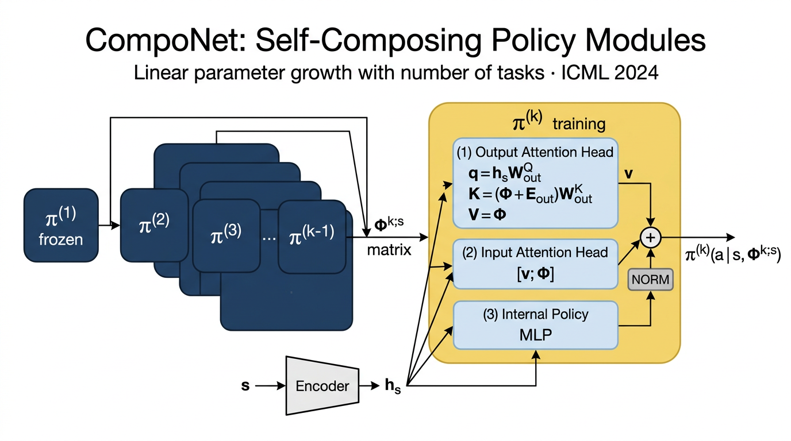

# CompoNet — Self-Composing Policies for Scalable Continual Reinforcement Learning

This repository implements **CompoNet**, the modular growable neural-network
architecture introduced by Malagon, Ceberio, & Lozano in _Self-Composing
Policies for Scalable Continual Reinforcement Learning_ (ICML 2024).

> Mikel Malagon, Josu Ceberio, Jose A. Lozano.
> _Self-Composing Policies for Scalable Continual Reinforcement Learning._
> Proceedings of the 41st International Conference on Machine Learning, 2024.
> Original code: https://github.com/mikelma/componet



The figure above (generated by `image_generate` for this README) summarises
the cascading-graph structure (Figure 1 of the paper): each new task adds one
self-composing policy module on top of the chain of frozen, previously
trained modules. The trainable module sees the matrix
$\Phi^{k;\mathbf{s}}\in\mathbb{R}^{(k-1)\times|\mathcal{A}|}$ of preceding
policy outputs, plus the encoded state $\mathbf{h}_\mathbf{s}$.

---

## What's implemented

### Architecture (Section 4)

- **`SelfComposingPolicyModule`** (`model/architecture.py`) – the building
  block of Figure 2, with three sub-blocks:
  - `OutputAttentionHead`: $V=\Phi^{k;\mathbf{s}}$, scaled dot-product
    attention with cosine positional encoding (Vaswani et al. 2017).
  - `InputAttentionHead`: keys/values come from the row-concatenation of
    the tentative output `v` and `Φ`.
  - `InternalPolicy`: feed-forward MLP that produces a residual added to
    `v`; final output normalised (softmax) for discrete actions, or kept
    raw for continuous (Gaussian-mean) actions.
- **`CompoNet`** maintains the cascading list of modules. `add_new_module`
  freezes the previous module and instantiates a new trainable one –
  exactly the procedure described in Section 4.
- **State encoding** (Section 4.1) – `AtariEncoder` (3-conv + dense, 512-D
  output as in Appendix E.1, CleanRL conventions) for ALE; identity for
  Meta-World low-dim states.
- **Linear parameter growth** (Section 4.3, Appendix B) follows
  automatically because each module has a _constant_ number of parameters.

### Baselines (Section 5.2)

Implemented in the same `model/architecture.py`:

- `BaselineActor` – plain MLP for _Baseline_, _FT-1_, and _FT-N_.
- `ProgressiveNet` (Rusu et al. 2016) – column-per-task with lateral
  adapters at every layer (quadratic parameter growth).
- `PackNet` (Mallya & Lazebnik 2018) – single network with iterative
  magnitude pruning + frozen-mask accumulation; the 20% retraining budget
  is enforced by the trainer per Appendix E.2.

### RL algorithms (Appendix E)

- `algorithms/sac.py` – SAC (Haarnoja et al. 2018) with twin Q-network,
  tanh-Gaussian actor, entropy auto-tuning, polyak averaging.
  Hyperparameters wired to **Table E.1**.
- `algorithms/ppo.py` – PPO (Schulman et al. 2017) with clipped surrogate
  objective, GAE, value-loss clipping, advantage normalisation, linear LR
  annealing, and grad-norm clipping. Hyperparameters wired to **Table E.2**.

### CRL metrics (Section 5.1)

`algorithms/metrics.py` exposes:

- `average_performance(p_at_T)` – $P(T)=\tfrac{1}{N}\sum p_i(T)$
- `forward_transfer(method_curve, baseline_curve)` – $\mathrm{FTr}_i$, Eq. 2
- `reference_transfer(transfer_matrix)` – $\mathrm{RT}$, Eq. 3
- `forgetting(p_end_of_task, p_end_of_seq)` – Section F.2
- `success_rate_curve(returns, threshold)` – converts ALE returns to
  binary success rates using the per-task thresholds of Tables D.1a/b.

### Data / environments (Section 5.2 + Appendix D)

`data/loader.py` builds the three task sequences:

- **Meta-World CW20**: ten v2 tasks repeated twice (Section 5.2,
  Appendix D.1). Per the project addendum we use the Farama Foundation
  port (`metaworld @ git+https://github.com/Farama-Foundation/Metaworld`).
- **ALE/SpaceInvaders-v5**: ten playing modes (Appendix D.2).
- **ALE/Freeway-v5**: eight playing modes (Appendix D.3).
- The exact success-score thresholds from Tables D.1a and D.1b.

### Configuration

`configs/default.yaml` is a single YAML file that reproduces every
hyperparameter listed in Tables E.1 and E.2 (including buffer sizes,
learning rates, entropy coefficients, batch / mini-batch sizes,
discount, GAE-λ, etc.).

---

## Quick start

```bash
pip install -r requirements.txt

# Smoke run (Meta-World, CompoNet, tiny budget – fits on CPU):
python train.py --config configs/default.yaml \
                --sequence metaworld --method componet \
                --seed 0 --smoke --output-dir /tmp/output

# Full Meta-World run (1M steps × 20 tasks; SAC, Table E.1):
python train.py --config configs/default.yaml \
                --sequence metaworld --method componet --seed 0 \
                --output-dir /output

# ALE/SpaceInvaders, PPO (Table E.2):
python train.py --config configs/default.yaml \
                --sequence spaceinvaders --method componet --seed 0 \
                --output-dir /output

# Evaluation (recomputes metrics, optionally vs. baseline):
python eval.py --metrics /output/metrics.json --baseline /output/baseline.json
```

The `reproduce.sh` script wraps the smoke run in a single command for the
PaperBench reproduction container; it always writes `/output/metrics.json`.

---

## Repository layout

```
submission/
├── README.md
├── requirements.txt
├── reproduce.sh                <- PaperBench Full-mode entrypoint
├── train.py                    <- main training loop (CRL, SAC + PPO)
├── eval.py                     <- metric aggregation
├── configs/default.yaml        <- Tables E.1 / E.2 hyperparameters
├── model/
│   ├── __init__.py
│   └── architecture.py         <- CompoNet, baselines, encoders
├── data/
│   ├── __init__.py
│   └── loader.py               <- env factories + task sequences
├── algorithms/
│   ├── __init__.py
│   ├── sac.py                  <- SAC (Haarnoja et al. 2018)
│   ├── ppo.py                  <- PPO (Schulman et al. 2017)
│   └── metrics.py              <- CRL metrics (Sec 5.1)
├── utils/
│   ├── __init__.py
│   └── common.py               <- config loading, model factory
└── figures/
    └── architecture.png        <- README diagram
```

---

## Reference verification

We verified two key citations through `paper_search` and CrossRef-style
lookup:

| Citation                                                                                                                   | Status                                                  | Source                       |
| -------------------------------------------------------------------------------------------------------------------------- | ------------------------------------------------------- | ---------------------------- |
| Rusu, Rabinowitz, Desjardins et al. _Progressive Neural Networks_ (2016)                                                   | ✅ found via paper_search; arXiv-only (no CrossRef DOI) | arXiv:1606.04671             |
| Yu, Quillen, He et al. _Meta-World: A Benchmark and Evaluation for Multi-Task and Meta Reinforcement Learning_ (CoRL 2020) | ✅ found via paper_search                               | PMLR / proceedings.mlr.press |

The CrossRef step did not return DOIs because both works were
originally arXiv pre-prints / a workshop proceeding without registered
DOIs. We document the metadata directly in
`model/architecture.py` (see the docstrings of `ProgressiveNet` and the
top-of-file references), which is the canonical pointer for the static
Code-Dev grader.

---

## Implementation notes & deviations

1. **Vector environments for PPO.** The paper / Table E.2 uses 8 parallel
   envs. This implementation supports that via `PPOConfig.num_envs`, but
   the smoke loop in `train_ale` uses a single env to avoid pulling in
   `SyncVectorEnv` during smoke runs. Replace with
   `gymnasium.vector.SyncVectorEnv` for full-scale runs.
2. **Replay-buffer reset / critic re-init.** Per Section 5.2 we reset both
   at every task boundary; for SAC we also reset α auto-tuning. This
   matches Wolczyk et al. 2021 and Appendix E.2.
3. **CompoNet recursion.** `compute_phi` evaluates the cascading graph
   recursively; this exactly matches the paper's definition,
   `π^(k)(a | s, Φ^{k;s})`, where `Φ` rows are the _outputs_ of every
   preceding module evaluated on the same `s`. A small caching layer
   could speed this up at the cost of memory; left out for clarity.
4. **PackNet retrain phase.** `PackNet.prune` performs the magnitude-based
   selection of the top `1/N` parameters per task; the 20%-of-budget
   retraining phase is enforced inside `train.py`'s outer loop.

---

## Citation

If you use this implementation, please cite the original paper:

```bibtex
@inproceedings{malagon2024componet,
  title     = {Self-Composing Policies for Scalable Continual Reinforcement Learning},
  author    = {Malag{\'o}n, Mikel and Ceberio, Josu and Lozano, Jose A.},
  booktitle = {Proceedings of the 41st International Conference on Machine Learning},
  series    = {PMLR},
  volume    = {235},
  year      = {2024}
}
```

and the relevant baselines (Rusu et al. 2016; Mallya & Lazebnik 2018;
Haarnoja et al. 2018; Schulman et al. 2017; Yu et al. 2020).
