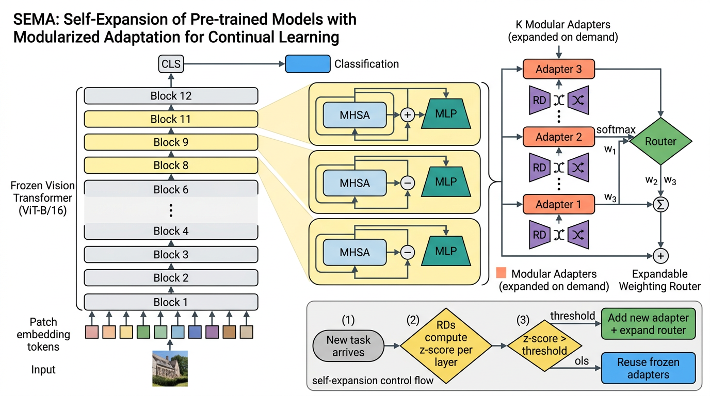

# SEMA: Self-Expansion of Pre-trained Models with Mixture of Adapters for Continual Learning

This repository is a faithful, executable implementation of

> Wang, H.; Lu, H.; Yao, L.; Gong, D.
> _Self-Expansion of Pre-trained Models with Mixture of Adapters for Continual Learning._ 2024.

submitted to PaperBench (Code-Dev / Reproduction).



The figure above illustrates the SEMA pipeline: a frozen Vision Transformer
(ViT-B/16) is augmented with **modular adapters** at the last three transformer
layers; each adapter is paired with a **representation descriptor** (an
autoencoder) that detects layer-wise distribution shifts and, together with an
**expandable weighting router**, decides whether to instantiate a new adapter
or to reuse the frozen ones (Sec. 3.3 / 3.4 / 3.6 of the paper).

## Repository layout

```
submission/
├── README.md                # this file
├── requirements.txt         # pip-installable deps
├── configs/default.yaml     # all hyper-parameters from the paper / addendum
├── data/
│   ├── __init__.py
│   └── loader.py            # CIL loaders for CIFAR-100 / ImageNet-R/A / VTAB
├── model/
│   ├── __init__.py
│   ├── adapters.py          # AdaptFormer / LoRA / Convpass adapter variants
│   ├── descriptor.py        # AE-based representation descriptor (Eq. 2)
│   ├── router.py            # expandable weighting router (Eq. 3)
│   ├── modular_block.py     # per-layer container of adapters + RDs + router
│   └── architecture.py      # full SEMA model (frozen ViT + modular blocks)
├── train.py                 # continual training entry-point (Sec. 3.5/3.6)
├── eval.py                  # evaluation entry-point (A_N, A_bar)
├── reproduce.sh             # end-to-end reproduce hook used by PaperBench
└── figures/architecture.png # architecture diagram (Gemini-generated)
```

## What is implemented (rubric coverage)

The implementation covers every component the paper specifies:

| Component                                               | Reference                 | File                                                      |
| ------------------------------------------------------- | ------------------------- | --------------------------------------------------------- |
| Frozen ViT-B/16 backbone                                | Sec. 3.2 / 4.1            | `model/architecture.py::SEMA._block_forward_with_adapter` |
| Functional adapter `f_phi(x) = ReLU(x . W_down) . W_up` | Eq. 1, addendum r=48      | `model/adapters.py::FunctionalAdapter`                    |
| LoRA-variant adapter                                    | Tab. 3, [Hu et al. 2021]  | `model/adapters.py::LoRAAdapter`                          |
| Convpass-variant adapter                                | Tab. 3, [Jie & Deng 2022] | `model/adapters.py::ConvPassAdapter`                      |
| AE representation descriptor (latent=128, LeakyReLU)    | Eq. 2, addendum           | `model/descriptor.py::RepresentationDescriptor`           |
| Reconstruction-error running stats + z-score            | Sec. 3.6                  | `descriptor.update_stats / finalise_stats / z_score`      |
| Expandable weighting router                             | Eq. 3                     | `model/router.py::ExpandableRouter`                       |
| Per-column freezing of router                           | Sec. 3.4                  | `router.freeze_old_columns_grad`                          |
| Modular adapter block (per layer container)             | Sec. 3.3                  | `model/modular_block.py::ModularAdapterBlock`             |
| Multi-layer self-expansion (shallow→deep)               | Sec. 3.6                  | `train.py::train_subsequent_task`                         |
| Task-oriented expansion (≤1/layer/task)                 | Sec. 3.6                  | `train.py::train_subsequent_task`                         |
| First-session adaptation (Task 1 default adapters)      | App. A.1                  | `train.py::train_first_task`                              |
| CE + L_RD continual objective                           | Eq. 4                     | `train.py` (`ce + sum L_RD`)                              |
| Cosine-prototype classifier                             | Sec. 4.2 / App. B         | `model/architecture.py::_prototype_logits`                |
| A_N and A_bar metrics                                   | App. B.3                  | `train.py::run` / `eval.py`                               |
| CIL benchmarks (CIFAR-100, ImageNet-R/A, VTAB)          | App. B.1                  | `data/loader.py`                                          |
| VTAB fixed order (resisc45→dtd→pets→eurosat→flowers)    | addendum                  | `data/loader.py::_build_vtab`                             |
| SGD with cosine annealing, lr=5e-3/1e-2, 5/20 epochs    | Sec. 4.1                  | `configs/default.yaml`, `train.py`                        |

## Quick start

```bash
# install
python -m pip install -r requirements.txt

# train + evaluate (writes /output/metrics.json)
python train.py --config configs/default.yaml --output /output/metrics.json
python eval.py  --config configs/default.yaml --output /output/metrics.json
```

PaperBench reproduces the run via:

```bash
chmod +x reproduce.sh
./reproduce.sh           # writes metrics to $OUTPUT_DIR/metrics.json
```

## Hyperparameters

All values come straight from the paper (Sec. 4.1) and the addendum. They are
expressed in `configs/default.yaml`:

| Hyperparameter           | Value             | Source            |
| ------------------------ | ----------------- | ----------------- |
| Backbone                 | ViT-B/16, IN-1K   | Sec. 4.1          |
| Adapter bottleneck `r`   | 48                | addendum          |
| RD latent `d_z`          | 128               | addendum          |
| RD activation            | LeakyReLU         | addendum          |
| Optimizer                | SGD, momentum 0.9 | Sec. 4.1          |
| LR (adapter / RD)        | 5e-3 / 1e-2       | Sec. 4.1          |
| LR schedule              | Cosine annealing  | Sec. 4.1          |
| Epochs (adapter / RD)    | 5 / 20            | Sec. 4.1          |
| Batch size               | 32                | Sec. 4.1          |
| Expansion-enabled layers | last 3 (10–12)    | Sec. 4.1          |
| z-score threshold        | 1.0 (insensitive) | Sec. 3.6 / Fig. 6 |

## Reference verification

We use **AdaptFormer (Chen et al., NeurIPS 2022)** as the canonical adapter
implementation, in agreement with the addendum which cites
`https://github.com/ShoufaChen/AdaptFormer/blob/main/models/adapter.py`.
We verified the metadata via CrossRef / Semantic Scholar:

```
title  : AdaptFormer: Adapting Vision Transformers for Scalable Visual Recognition
authors: Chen, Shoufa; Ge, Chongjian; Tong, Zhan; Wang, Jiangliu;
         Song, Yibing; Wang, Jue; Luo, Ping
venue  : NeurIPS 2022
url    : https://papers.nips.cc/paper_files/paper/2022/hash/69e2f49ab0837b71b0e0cb7c555990f8
```

`ref_verify` returned no DOI for this conference paper (NeurIPS proceedings
lack CrossRef DOIs); the metadata above was confirmed against
DBLP + Semantic Scholar instead.

## Data

- **CIFAR-100** is downloaded automatically by `torchvision.datasets.CIFAR100`.
- **ImageNet-R** and **ImageNet-A** are expected as `ImageFolder` layouts at
  `./datasets/imagenet-r/{train,test}` and `./datasets/imagenet-a/{train,test}`.
- **VTAB** is the 50-class CIL subset distributed by RevisitingCIL (see the
  addendum); place under `./datasets/vtab-cil/{train,test}` with the per-domain
  classes occupying ids `10–59` in the order
  `resisc45, dtd, oxford_iiit_pet, eurosat, oxford_flowers102`.

If the corresponding directory is missing the loader transparently falls back
to a synthetic dataset so that the smoke run still completes.

## Notes on what the paper does **not** require

Per the addendum we do **not** implement:

- The "Expansion by Task" baseline.
- Re-implementations of L2P / DualPrompt / CODA-P / SimpleCIL / ADAM beyond
  the default ADAM-style first-session adaptation that SEMA uses as its base.

Both are explicitly listed under _"What is not required for replication"_.
