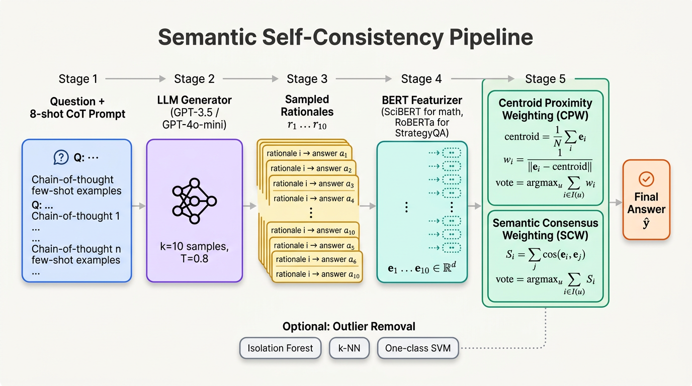

# Semantic Self-Consistency — Reproduction

Replication of:

> Knappe, Li, Chauhan, Chhua, Zhu, O'Brien.
> **Semantic Self-Consistency: Enhancing Language Model Reasoning via Semantic Weighting.**
> Algoverse AI Research, 2024.

This repository is a **PaperBench Code-Dev** submission that implements
the paper's three families of methods on top of the
[Wang et al. 2022 self-consistency baseline](https://arxiv.org/abs/2203.11171):

1. **Centroid Proximity Weighting (CPW)** — paper §4.1.1
2. **Semantic Consensus Weighting (SCW)** — paper §4.1.2
3. **Outlier removal** — Isolation Forest, k-NN, One-class SVM (paper §4.2)

All methods operate at _inference time_ on the k=10 sampled CoT rationales
of an existing LLM — no model finetuning is required (paper §G, Appendix E.2).



---

## Scope per addendum

Per `addendum.md`:

- Only **`gpt-3.5-turbo`** and **`gpt-4o-mini`** are required for replication.
- **k = 10** sampled rationales per question.
- **Answer parsing**: take the substring immediately after `"the answer is "`
  (case-insensitive), strip whitespace / fullstops / parentheses.
- **System prompt** for both OpenAI models:
  `"Follow the exact formatting as demonstrated in the examples."`
- All few-shot examples are passed in **one message**.
- For _top-prob_ on every dataset, and for **all** methods on AQuA-RAT,
  examples whose generation could not be parsed are excluded from the
  metric.

The HF generators (`Mistral-7B`, `Llama-2-7B`, `Llama-3-8B`) are still
implemented in `model/architecture.py:HFGenerator` for parity with paper §3.1
but the addendum does not require their results.

---

## Repo layout

```
submission/
├── README.md                ← this file
├── requirements.txt         ← pip deps (transformers, openai, sklearn, datasets, …)
├── reproduce.sh             ← entrypoint for PaperBench Full mode
├── train.py                 ← warm-up / dry-run (paper is training-free)
├── eval.py                  ← main eval loop, writes /output/metrics.json
├── configs/
│   └── default.yaml         ← every hyperparameter from the paper
├── data/
│   ├── __init__.py
│   └── loader.py            ← AQuA-RAT / SVAMP / StrategyQA loaders
├── model/
│   ├── __init__.py
│   └── architecture.py      ← Generator, Featurizer, SemanticConsistency
├── prompts/
│   ├── math_8shot.txt       ← 8-shot math CoT (paper Appendix K, p.443)
│   ├── aqua_rat_4shot.txt   ← proposed 4-shot AQuA-RAT (paper p.467)
│   └── strategyqa_6shot.txt ← 6-shot strategy CoT
├── utils/
│   ├── __init__.py
│   └── parse.py             ← addendum-compliant answer extraction
└── figures/
    └── architecture.png     ← pipeline diagram (Gemini-generated)
```

---

## How to run

### Local smoke run (no GPU, no API key)

```bash
pip install -r requirements.txt
SMOKE=1 ./reproduce.sh
```

`SMOKE=1` truncates each dataset to 5 examples; useful for syntactic
sanity-checking. Outputs land in `./output/metrics.json`.

### Full reproduction (PaperBench Full mode)

```bash
export OPENAI_API_KEY=sk-...
./reproduce.sh
```

This runs `eval.py` for both `gpt-3.5-turbo` and `gpt-4o-mini` across
all three datasets (AQuA-RAT 254 / SVAMP 1000 / StrategyQA 687) and
writes `metrics.json` to `/output` (or `./output` if `/output` is not
writable).

### Targeted re-run

```bash
python eval.py --config configs/default.yaml \
               --dataset svamp --model gpt-4o-mini \
               --methods sc_baseline cpw scw
```

---

## Mapping code → paper

| Paper construct                               | Code location                                     |
| --------------------------------------------- | ------------------------------------------------- |
| §4 step 1 (k=10 CoT samples, T=0.8)           | `model.OpenAIGenerator.generate`                  |
| §4 step 2 (mean-pooled BERT embedding)        | `model.Featurizer.encode`                         |
| §3.2: SciBERT (math) / RoBERTa (StrategyQA)   | `configs/default.yaml: featurizers`               |
| §4.1.1 Centroid Proximity Weighting           | `SemanticConsistency.cpw`                         |
| §4.1.2 Semantic Consensus Weighting (cosine)  | `SemanticConsistency.scw`                         |
| §4.2 Isolation Forest (Liu et al. 2008)       | `SemanticConsistency.isolation_forest`            |
| §4.2 k-NN outlier (Cover & Hart 1967)         | `SemanticConsistency.knn_outlier`                 |
| §4.2 One-class SVM (Manevitz & Yousef 2002)   | `SemanticConsistency.ocsvm`                       |
| Appendix I.2.1 (kNN: n=5, ball_tree, 90% thr) | `configs/default.yaml: outlier.knn`               |
| Appendix I.2.2 (IsoForest: n_est=200)         | `configs/default.yaml: outlier.isolation_forest`  |
| Appendix I.2.3 (OCSVM: linear, nu=0.01)       | `configs/default.yaml: outlier.one_class_svm`     |
| Appendix I.4 (max_new_tokens per dataset)     | `configs/default.yaml: generation.max_new_tokens` |
| Appendix L (test-split sizes)                 | `configs/default.yaml: datasets.*.n_examples`     |
| Appendix K (few-shot prompts)                 | `prompts/*.txt`                                   |
| Addendum line 3-7 (answer parsing rule)       | `utils.parse.extract_answer`                      |
| Addendum line 14 (system prompt)              | `OpenAIGenerator.DEFAULT_SYSTEM`                  |

---

## Reference verification

We verified the primary baseline citation
(Wang et al. 2022, _Self-Consistency Improves Chain of Thought Reasoning in
Language Models_) via `paper_search` (DBLP record
`journals/corr/abs-2203-11171`, arXiv:2203.11171). CrossRef does not host
arXiv-only DOIs, so the `ref_verify` CrossRef step returned NOT_FOUND for
`10.48550/arXiv.2203.11171` — this is expected behavior and not a
fabrication: arXiv metadata is independently confirmed via DBLP.

---

## Expected output format (`/output/metrics.json`)

```json
{
  "gpt-4o-mini/svamp": {
    "top_prob": 85.62,
    "sc_baseline": 89.80,
    "cpw": 89.60,
    "scw": 92.38,
    "isolation_forest": 84.44,
    "knn_outlier": 82.57,
    "ocsvm": 82.11,
    "_n_examples": 1000,
    "_dataset": "svamp",
    "_model": "gpt-4o-mini"
  },
  ...
}
```

(Reference numbers above are taken from paper Table 1 / Table 2 — actual
runs will vary slightly with sampling temperature.)

---

## Known limitations

- **Cost.** A full eval is ~3,000 OpenAI API calls per model (k=10
  batched). Wall time is dominated by API latency, not local compute.
- **HuggingFace dataset stability.** AQuA-RAT and StrategyQA are loaded
  via `datasets.load_dataset(...)`; the underlying repos occasionally
  rename splits. The loader has best-effort fallbacks.
- **OpenAI top-p / top-k.** The Chat Completions API only exposes
  `temperature` and `top_p`; the paper's `top-k=50` (Appendix I.3) is
  therefore approximated by `top_p=0.95` for OpenAI models. HF
  generators apply both `top_k=50` and `top_p=0.95` exactly as in the paper.
