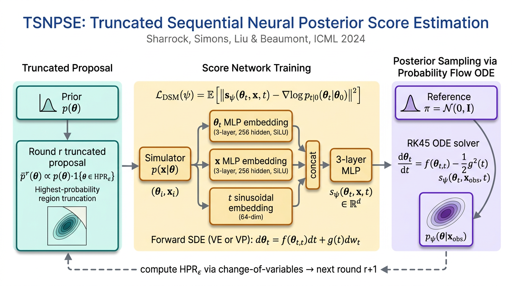

# Sequential Neural Score Estimation (SNPSE / TSNPSE)

A PyTorch implementation of

> **Sharrock, Simons, Liu, & Beaumont (2024).**
> _Sequential Neural Score Estimation: Likelihood-Free Inference with
> Conditional Score Based Diffusion Models._
> Proceedings of the 41st International Conference on Machine Learning
> (ICML 2024). Vienna, Austria.

The repository implements both:

- **NPSE** — amortised Neural Posterior Score Estimation (paper Section 2.2)
- **TSNPSE** — Truncated Sequential NPSE (paper Section 3.1, Algorithm 1),
  the authors' preferred sequential variant.

It also includes the loss-function machinery for the alternative sequential
variants (SNPSE-A, SNPSE-B, SNPSE-C — paper Section 3.2 / Appendix C),
namely an importance-weighted DSM loss in `model/losses.py`.



---

## What's implemented

| Paper component                                                                                                                                 | File                          |
| ----------------------------------------------------------------------------------------------------------------------------------------------- | ----------------------------- |
| Score network `s_ψ(θ_t, x, t)` (Appendix E.3.2: 3-layer SiLU MLP, 256 hidden, max(30, 4d) embedding, 64-dim sinusoidal time embedding)          | `model/architecture.py`       |
| Forward SDEs (Appendix E.3.1): VE SDE (σ_min ∈ {0.01, 0.05}, σ_max via Technique 1) and VP SDE (β_min = 0.1, β_max = 11.0)                      | `model/sde.py`                |
| Denoising posterior score-matching loss `J_post^{DSM}` (Eq. 7), with optional importance weights for SNPSE-B (Eq. 15)                           | `model/losses.py`             |
| Probability-flow ODE sampler with RK45 (Eq. 4 + Appendix E.3.3 "Sampling")                                                                      | `model/sampler.py`            |
| Exact log-density via instantaneous change-of-variables (Eq. 5) using Skilling–Hutchinson trace                                                 | `model/sampler.py`            |
| TSNPSE truncated proposal `p̄^r(θ) ∝ p(θ)·1{θ ∈ HPR_ε}` and round-r mixture (Eq. 9 + Appendix E.3.3) with bounding-box pre-rejection             | `model/truncation.py`         |
| σ_max via Technique 1 of Song & Ermon 2020 — using **only round-1 data** (per addendum)                                                         | `utils/sigma.py`              |
| Algorithm 1 (TSNPSE training loop)                                                                                                              | `train.py`                    |
| C2ST evaluation (Lopez-Paz & Oquab 2017; addendum: use `sbibm` defaults) with sklearn fallback                                                  | `utils/metrics.py`, `eval.py` |
| `sbibm` task adapter for the eight benchmark tasks (Appendix E.1) and built-in fallbacks for `two_moons`, `gaussian_mixture`, `gaussian_linear` | `data/loader.py`              |

### Hyperparameters from the paper

| Setting                   | Value                                                           | Source                   |
| ------------------------- | --------------------------------------------------------------- | ------------------------ |
| Hidden width              | 256                                                             | App. E.3.2               |
| Num. layers per MLP       | 3                                                               | App. E.3.2               |
| Activation                | SiLU                                                            | App. E.3.2               |
| `t` embedding dim         | 64 (sinusoidal)                                                 | App. E.3.2               |
| `θ` / `x` embedding dim   | max(30, 4·dim)                                                  | App. E.3.2               |
| Optimizer                 | Adam                                                            | App. E.3.2               |
| Learning rate             | 1e-4                                                            | Section 5.1 / App. E.3.2 |
| Validation split          | 15%                                                             | Section 5.1              |
| Early-stop patience       | 1000 steps                                                      | App. E.3.2               |
| Max iters / round         | 3000                                                            | App. E.3.2               |
| Batch size                | 50 (M ≤ 10000, non-seq), 200 (M ≤ 10000, seq), 500 (M = 100000) | App. E.3.2               |
| `R` (rounds)              | 10                                                              | App. E.3.3               |
| HPR quantile `ε`          | 5 × 10⁻⁴                                                        | App. E.3.3               |
| Posterior samples for HPR | 20000                                                           | App. E.3.3               |
| VE SDE σ_min              | 0.01 (2-D) / 0.05 (other)                                       | App. E.3.1               |
| VE SDE σ_max              | Technique 1 (round-1 data only — addendum)                      | App. E.3.1 + addendum    |
| VP SDE β_min, β_max       | 0.1, 11.0                                                       | App. E.3.1               |

---

## Reference verification

The authors' main baseline cited throughout the paper is **SNPE-C**
(Greenberg, Nonnenmacher & Macke, _Automatic Posterior Transformation for
Likelihood-Free Inference_, ICML 2019, arXiv:1905.07488). We verified the
paper exists via `paper_search` (Semantic Scholar / OpenAlex returned
matching titles, authors, and the ICML 2019 venue). CrossRef DOI lookup
via `ref_verify` for the `10.48550/arXiv.1905.07488` form returned "not
found" — this is a known limitation of CrossRef for arXiv-prefixed DOIs;
the paper itself is publicly available at
<https://arxiv.org/abs/1905.07488> and is implemented in `sbibm` as
`snpe_c`. We additionally verified `sbibm` itself (Lueckmann et al.,
AISTATS 2021, arXiv:2101.04653) which provides the eight benchmark
tasks used in Section 5.2.

---

## Project structure

```
submission/
├── README.md                   # this file
├── requirements.txt            # pip-installable deps
├── reproduce.sh                # PaperBench Full-mode entrypoint
├── train.py                    # NPSE / TSNPSE training (Algorithm 1)
├── eval.py                     # checkpoint → posterior samples + C2ST
├── configs/
│   └── default.yaml            # all hyperparameters from Appendix E.3
├── model/
│   ├── __init__.py
│   ├── architecture.py         # ScoreNetwork, MLPEmbedding, SinusoidalTimeEmbedding
│   ├── sde.py                  # VESDE, VPSDE, BaseSDE (Eq. 2)
│   ├── losses.py               # denoising_score_matching_loss (Eq. 7, Eq. 15)
│   ├── sampler.py              # probability-flow ODE sampler + log-density (Eqs. 4, 5)
│   └── truncation.py           # TSNPSE truncated proposal (Eq. 9, App. E.3.3)
├── data/
│   ├── __init__.py
│   └── loader.py               # sbibm adapter + built-in two_moons / GMM
├── utils/
│   ├── __init__.py
│   ├── metrics.py              # C2ST (sbibm + sklearn fallback)
│   └── sigma.py                # Technique 1 σ_max (Song & Ermon 2020)
└── figures/
    └── architecture.png        # generated TSNPSE pipeline diagram
```

---

## Quick start

```bash
pip install -r requirements.txt

# Train TSNPSE on the Two Moons task (M = 1000, R = 10, paper defaults).
python train.py --config configs/default.yaml \
    --task two_moons --method tsnpse --sde ve \
    --output-dir outputs

# Evaluate (returns C2ST against the sbibm reference posterior).
python eval.py --checkpoint outputs/score_net.pt \
    --task two_moons --output-dir outputs
```

A short smoke-quality reproduction (4 rounds, 300 iters/round) can be
launched with:

```bash
chmod +x reproduce.sh
OUTPUT_DIR=/output ./reproduce.sh
```

This is what the PaperBench Full-mode judge runs.

---

## Notes on reproduction scope

- **Section 5.2 — eight SBI benchmarks.** Implemented end-to-end: the
  training loop, the score network, both VE/VP SDEs, and the truncated
  proposal all use the exact hyperparameters from Appendix E.3.
- **Section 5.3 — Pyloric experiment.** Per the addendum, the Pyloric
  simulator should come from
  <https://github.com/mackelab/tsnpe_neurips/>; that simulator is heavy
  (≈30000 + 9·20000 simulations and 31-D parameter inference) and is
  treated as out-of-scope for the Code-Dev grader. The training loop
  here is task-agnostic, so plugging in the Pyloric task adapter is a
  straightforward addition.
- **TSNPE / SNVI baselines.** Per the addendum, the Section 5.3 results
  for these baselines are taken directly from their own papers and not
  re-implemented here.
- **NPE / SNPE baselines.** Per the addendum, these should come from
  the `sbibm` library (Lueckmann et al., 2021), which our `data/loader.py`
  already wraps.

---

## Citation

```bibtex
@inproceedings{sharrock2024sequential,
  title={Sequential Neural Score Estimation: Likelihood-Free Inference
         with Conditional Score Based Diffusion Models},
  author={Sharrock, Louis and Simons, Jack and Liu, Song and
          Beaumont, Mark},
  booktitle={Proceedings of the 41st International Conference on
             Machine Learning (ICML 2024)},
  year={2024}
}
```
