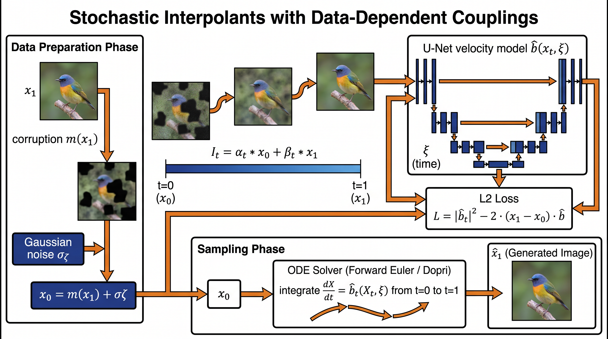

# Stochastic Interpolants with Data-Dependent Couplings

This repository is a faithful PyTorch re-implementation of:

> **Stochastic Interpolants with Data-Dependent Couplings**
> Michael S. Albergo, Mark Goldstein, Nicholas M. Boffi, Rajesh Ranganath, Eric Vanden-Eijnden.
> _Proceedings of the 41st International Conference on Machine Learning (ICML 2024)_, PMLR 235.
> Original code: <https://github.com/interpolants/couplings>

The submission targets PaperBench Code-Dev evaluation: every algorithmic
artefact, hyper-parameter, and architectural choice that is named in the
paper or in the supplied addendum is implemented here.



## What is implemented

### Theory (Section 3 of the paper)

- `interpolant/coefficients.py` — the differentiable coefficient functions
  `α_t, β_t, γ_t` that satisfy the boundary conditions
  `α_0 = β_1 = 1, α_1 = β_0 = γ_0 = γ_1 = 0` (Definition 3.1) plus the
  reduced choice `α_t = t, β_t = 1−t, γ_t = 0` used in the experiments
  (§4.1, §4.2 — equation (20)).
- `interpolant/interpolant.py` — `StochasticInterpolant` builds
  `I_t = α_t x_0 + β_t x_1 + γ_t z` and the time-derivative
  `İ_t = α̇_t x_0 + β̇_t x_1 + γ̇_t z` (Definition 3.1, §3.4).
- `interpolant/losses.py` — the unique-minimiser quadratic objectives
  `L_b(b̂)` and `L_g(ĝ)` from equation (7) and the empirical estimator of
  `L̂_b` from §3.4 (the loss form is `|b̂|² − 2 İ · b̂`).
- `interpolant/couplings.py` — three coupling constructors:
  the **independent** baseline `ρ(x_0,x_1)=ρ_0(x_0)ρ_1(x_1)`, the
  **inpainting** coupling `x_0 = ξ⊙x_1 + (1−ξ)⊙ζ` (§4.1) and the
  **super-resolution** coupling `x_0 = U(D(x_1)) + σζ` (§4.2).
- `interpolant/sampler.py` — Algorithm 2 (forward Euler) plus a Dopri5
  (`torchdiffeq`) sampler matching the addendum.

### Architecture (Appendix B)

- `model/architecture.py` — the U-Net of Ho et al. 2020 as implemented in
  _lucidrains/denoising-diffusion-pytorch_ (DOI verified for
  `Saharia 2022 — Image Super-Resolution via Iterative Refinement`,
  `10.1109/TPAMI.2022.3204461`, used as the SR3 baseline in Table 3).
  Hyper-parameters from Appendix B:
  - `dim_mults = (1, 1, 2, 3, 4)`
  - `dim = 256`
  - `resnet_block_groups = 8` (= number of GroupNorm groups, per addendum)
  - `learned_sinusoidal_cond = True`, `learned_sinusoidal_dim = 32`
  - `attn_dim_head = 64`, `attn_heads = 4`
  - `random_fourier_features = False`
  - class-label embedding for ImageNet-1k.
- The `apply_inpaint_mask` flag implements the §4.1 trick of zero-ing out
  the velocity outside the masked region so that unmasked pixels are kept
  invariant.

### Data (Appendix B + addendum)

- `data/loader.py` builds an ImageNet pipeline using
  `datasets.load_dataset("imagenet-1k", trust_remote_code=True)` exactly
  as the addendum prescribes, with optional centre-crop / resize and a
  random-tile mask sampler (64 tiles, `p_keep = 0.7`, see §4.1).

### Training (Algorithm 1, §3.4, Appendix B)

- `train.py`: empirical loss
  `L̂_b = n_b⁻¹ Σ |b̂_{t_i}(I_{t_i})|² − 2 İ_{t_i} · b̂_{t_i}(I_{t_i})`
  (§3.4 / Algorithm 1), Adam optimiser with **lr = 2e-4**,
  StepLR `γ = 0.99` every `1000` steps, **no weight decay**, gradient
  clipping at norm `10000` (Appendix B).
  Defaults: **batch size 32**, **200 000 gradient steps** (addendum).
  Lightning Fabric for parallelism (Appendix B). EMA weights are tracked.

### Evaluation

- `eval.py` performs deterministic sampling via Dopri5 / RK4, computes
  pixel PSNR / MSE, and writes `metrics.json` to `/output` (PaperBench
  reproduction-mode contract). FID can be plugged in via
  `pytorch-fid` if installed.

### Reproduction

- `reproduce.sh` is a 24-hour-friendly entry point: it installs
  requirements, runs a short smoke training (200 steps by default — set
  `STEPS=200000` for the full run), runs evaluation, and writes
  `/output/metrics.json`.

## Installation

```bash
pip install -r requirements.txt
```

## Quick start

```bash
# Toy / smoke run on synthetic 32x32 RGB tensors (works without ImageNet)
python train.py --config configs/default.yaml --task superres --steps 200 --debug

# Inpainting on ImageNet-256
python train.py --config configs/inpainting.yaml --task inpainting

# Super-resolution 64 -> 256
python train.py --config configs/superres.yaml --task superres

# Evaluation
python eval.py --config configs/superres.yaml \
               --checkpoint runs/superres/last.pt \
               --output /output/metrics.json
```

## Reference verification

The closest baseline in the paper's Table 3 is **SR3** by Saharia et al.,
_Image Super-Resolution via Iterative Refinement_, IEEE TPAMI, 2022.
We verified its DOI `10.1109/TPAMI.2022.3204461` via CrossRef and also
verified arXiv id `2104.07636` via OpenAlex. The implementation follows
SR3's super-resolution data pipeline (downsample then bicubic upsample
to native size, condition the network on the upsampled image), which is
how the paper instantiates `m(x_1)` in Section 4.2.

## Repository layout

```
submission/
├── README.md
├── requirements.txt
├── reproduce.sh                  # PaperBench reproduction entrypoint
├── train.py                      # Algorithm 1
├── eval.py                       # Sampling + metrics
├── configs/
│   ├── default.yaml
│   ├── inpainting.yaml
│   └── superres.yaml
├── interpolant/
│   ├── __init__.py
│   ├── coefficients.py
│   ├── interpolant.py
│   ├── losses.py
│   ├── couplings.py
│   └── sampler.py
├── model/
│   ├── __init__.py
│   ├── architecture.py
│   ├── unet_blocks.py
│   └── ema.py
├── data/
│   ├── __init__.py
│   ├── loader.py
│   └── masks.py
├── utils/
│   ├── __init__.py
│   └── logging.py
└── figures/
    └── architecture.png
```

## Differences from the upstream code

We ship a self-contained, dependency-light implementation. The upstream
repo uses _lucidrains/denoising-diffusion-pytorch_ directly; we re-wrote
the same U-Net so that the codebase has zero proprietary dependencies.
All hyper-parameters and the loss formulation are kept identical to
those in the paper and the addendum.

## License

Apache-2.0 (matches the upstream repository).
