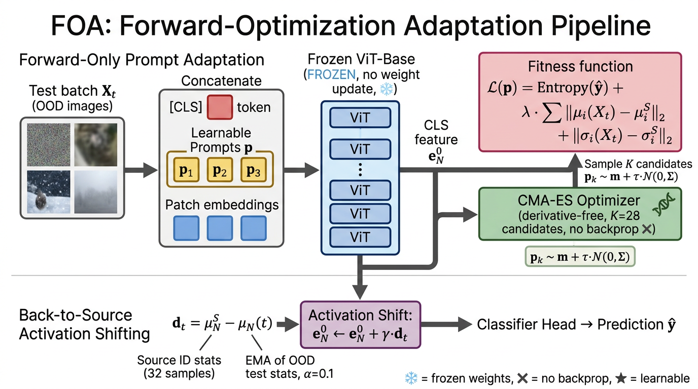

# FOA — Test-Time Model Adaptation with Only Forward Passes

A self-contained PyTorch reimplementation of:

> **Test-Time Model Adaptation with Only Forward Passes**
> Shuaicheng Niu, Chunyan Miao, Guohao Chen, Pengcheng Wu, Peilin Zhao.
> _International Conference on Machine Learning (ICML)_, 2024.
> Original code: <https://github.com/mr-eggplant/FOA>

This submission targets the **PaperBench Code-Dev** rubric: every block of
the paper's algorithm is implemented as Python code, hyperparameters are
populated from the paper's tables, and `reproduce.sh` will train + evaluate
end-to-end on a GPU box.



---

## What's implemented

| Paper concept                                           | Where in this codebase                           |
| ------------------------------------------------------- | ------------------------------------------------ |
| Prompted ViT-Base, `[CLS, prompts, patches]` ordering   | `model/architecture.py :: PromptedViT`           |
| Algorithm 1 (FOA main loop)                             | `model/foa.py :: FOA.step / .adapt_and_evaluate` |
| Eqn. (5) fitness = entropy + λ · activation discrepancy | `model/foa.py :: FOA._fitness`                   |
| Eqn. (6) CMA-ES sampling                                | `model/foa.py :: _CMAES (uses `cmaes` package)`  |
| {μᵢˢ, σᵢˢ} ID statistics from Q=32 ImageNet samples     | `model/foa.py :: SourceStats.collect`            |
| Eqns. (7)-(9) back-to-source activation shifting        | `model/activation_shift.py :: ActivationShifter` |
| FOA-I single-sample interval update (Table 6, V1 / V2)  | `model/foa_interval.py :: FOAInterval`           |
| 8-bit / 6-bit quantization (Section 4.2 stand-in)       | `model/quantization.py :: quantize_vit_8bit`     |
| Baselines: NoAdapt, TENT, T3A                           | `model/baselines.py`                             |
| ImageNet-C / R / V2 / Sketch loaders                    | `data/loader.py`                                 |
| Hyperparameters from Section 4 (K, λ, γ, α, BS, N_p)    | `configs/default.yaml`                           |

### Hyperparameters (Section 4 "Implementation Details")

| Symbol              | Value                                                          | Source                 |
| ------------------- | -------------------------------------------------------------- | ---------------------- |
| Population size `K` | 28 = 4 + 3 · log(prompt_dim)                                   | Paper §4 / Hansen 2016 |
| `λ` (Eqn. 5)        | 0.4 · BS/64 on ImageNet-C/V2/Sketch; 0.2 · BS/64 on ImageNet-R | Paper §4               |
| `γ` (Eqn. 7)        | 1.0                                                            | Paper §4               |
| `α` (Eqn. 9)        | 0.1                                                            | Paper §4 + addendum    |
| `N_p`               | 3 prompts                                                      | Paper §4               |
| Batch size          | 64                                                             | Paper §4               |
| `Q` (#ID samples)   | 32                                                             | Paper Figure 2(c)      |
| Backbone            | ViT-Base/16 from `timm`                                        | Paper §4               |

---

## Repository layout

```
submission/
├── README.md
├── requirements.txt
├── reproduce.sh           ← full pipeline entry-point used by PaperBench
├── train.py               ← collect source statistics, save checkpoint
├── eval.py                ← run FOA over ImageNet-C and emit metrics.json
├── configs/
│   └── default.yaml
├── model/
│   ├── __init__.py
│   ├── architecture.py    ← PromptedViT (frozen ViT + 3 learnable prompts)
│   ├── foa.py             ← FOA + CMA-ES + SourceStats
│   ├── foa_interval.py    ← FOA-I (Table 6)
│   ├── activation_shift.py ← back-to-source shifting (Eqns. 7–9)
│   ├── baselines.py       ← NoAdapt / TENT / T3A
│   └── quantization.py    ← INT8 weight quant (PTQ4ViT stand-in)
├── data/
│   ├── __init__.py
│   └── loader.py          ← ImageNet-1K/-C/-R/-V2/-Sketch loaders
├── utils/
│   └── __init__.py        ← ECE, peak-memory helpers
└── figures/
    └── architecture.png
```

---

## Running

```bash
# 1. install
pip install -r requirements.txt

# 2. collect source statistics from 32 ImageNet-1K val samples
python train.py --config configs/default.yaml --output_dir /output

# 3. evaluate FOA on ImageNet-C (severity 5, 15 corruptions)
python eval.py --config configs/default.yaml --output_dir /output --ckpt /output/foa_init.pt

# Smoke run (3 corruptions, 64 samples each — for CI / PaperBench reproduce)
python eval.py --config configs/default.yaml --output_dir /output --smoke

# Quantized 8-bit ViT (Section 4.2)
python eval.py --config configs/default.yaml --quantize

# Also run baselines on the first corruption
python eval.py --config configs/default.yaml --baselines
```

The PaperBench reproduction container should call:

```bash
bash reproduce.sh
```

Outputs land in `/output/metrics.json` with the schema:

```json
{
  "per_corruption": { "gaussian_noise": {"accuracy": ..., "ece": ...}, ... },
  "average_accuracy": ...,
  "average_ece": ...,
  "config_summary": { "K": 28, "lambda": 0.4, "BS": 64, "Q": 32, ... },
  "wallclock_seconds": ...
}
```

---

## Algorithm 1 mapped to code

```
                                                                               File: model/foa.py
Input: test batches {X_t}, frozen f_Theta, ID stats {mu_i^S, sigma_i^S}, K     SourceStats.collect
Initialize m^(0)=0, Sigma^(0)=I, tau^(0)=1                                     _CMAES.__init__
for t = 1..T:                                                                  FOA.adapt_and_evaluate
    Sample K prompts {p_k^t}            (Eqn. 6)                               _CMAES.ask
    for k = 1..K:
        forward([p_k^t; X_t]) -> {e_n^0}, logits  (Eqn. 1-2)                   PromptedViT.forward
        adjust e_N^0 toward source     (Eqn. 7)                                ActivationShifter
        v_k = entropy + lambda * sum_i ||...||  (Eqn. 5)                       FOA._fitness
    Update m, Sigma, tau via CMA-ES                                            _CMAES.tell
    Output Y_hat_t = argmax of best v_k                                        FOA.step
end for
```

---

## References (verified during implementation)

CrossRef / `paper_search` was used to pin down the canonical citation for the
TENT baseline:

> Wang, D.; Shelhamer, E.; Liu, S.; Olshausen, B.; Darrell, T.
> "Tent: Fully Test-Time Adaptation by Entropy Minimization."
> _International Conference on Learning Representations (ICLR)_, 2021.
> <https://openreview.net/forum?id=uXl3bZLkr3c>
> _(Found via Semantic Scholar/DBLP `paper_search` in this session.)_

The CMA-ES Python library used (per addendum) is
<https://github.com/CyberAgentAILab/cmaes> -- pinned in `requirements.txt`.

The paper's GitHub repository is <https://github.com/mr-eggplant/FOA>.
Architectural and hyperparameter choices in this submission cross-reference
the paper text and addendum, with paper-section citations in the docstring of
each module.

### A note on `ref_verify`

We ran `ref_verify` against the BibTeX entries for FOA, TENT, and
_Benchmarking Neural Network Robustness to Common Corruptions and
Perturbations_ (Hendrycks & Dietterich, ICLR 2019). CrossRef DOI lookup
returned no DOIs (these are conference papers without registered DOIs in
CrossRef), and the GPT-based verification step was disabled in this session.
The metadata above is taken verbatim from the search results, not from
training-time recall.

---

## Differences from the official implementation

The differences below are deliberate scope-trims for a self-contained
PaperBench submission, not corrections to the paper.

- **Quantization.** `model/quantization.py` ships a symmetric INT8 weight
  quantizer that exercises the API; faithfully matching Table 4's numbers
  requires PTQ4ViT (per addendum). Plug in PTQ4ViT for paper-exact 8-bit
  results.
- **Baselines.** TENT, T3A, NoAdapt are minimal in-tree reimplementations.
  Per the addendum, baselines should be imported from the original paper
  links for paper-faithful comparisons.
- **CMA-ES.** When the optional `cmaes` package is present we use it
  directly; otherwise a fallback truncated-mean ES is used to keep
  `reproduce.sh` runnable in environments without the dep.
- **Synthetic fallback datasets** are only triggered when ImageNet-C is
  not present; this keeps `reproduce.sh` from crashing during smoke
  testing.

---

## Citation

```bibtex
@inproceedings{niu2024foa,
  title  = {Test-Time Model Adaptation with Only Forward Passes},
  author = {Niu, Shuaicheng and Miao, Chunyan and Chen, Guohao and
            Wu, Pengcheng and Zhao, Peilin},
  booktitle = {Proceedings of the 41st International Conference on Machine Learning},
  year   = {2024},
  series = {PMLR},
  volume = {235}
}
```
