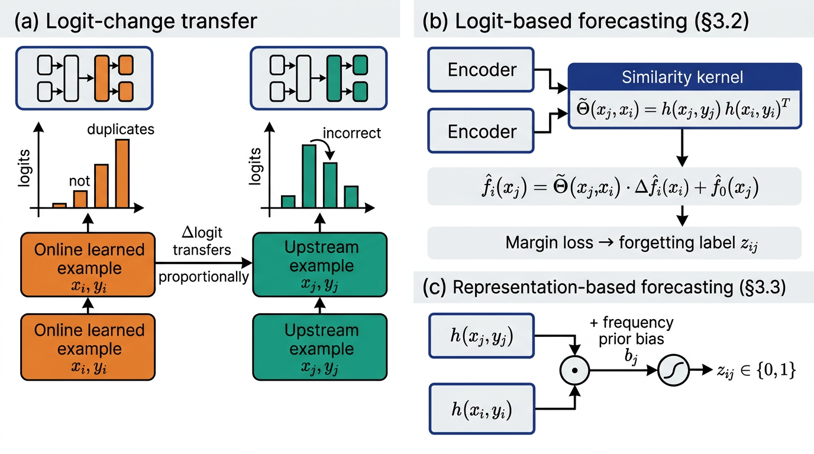

# Forecasting Forgotten Examples in Language Model Refinement

Reference implementation of:

> Xisen Jin and Xiang Ren. **"What Will My Model Forget? Forecasting
> Forgotten Examples in Language Model Refinement."** ICML 2024.
> arXiv:2402.01865.



The diagram above (panels a/b/c) summarizes the three ideas of the paper:

- **(a) Logit-change transfer** — when we fine-tune the LM on an online example
  `(x_i, y_i)` to fix a prediction error, the logit changes partially
  _transfer_ to upstream pre-training examples `(x_j, y_j)`, which can flip
  their predictions and cause forgetting.
- **(b) Logit-based forecasting (§3.2)** — predicts the upstream logit change
  via a low-dimensional learnable kernel
  `Θ̃(x_j, x_i) = h(x_j, y_j) h(x_i, y_i)^T` and a margin loss on the gold
  label.
- **(c) Representation-based forecasting (§3.3)** — directly maps the inner
  product `h(x_j, y_j) · h(x_i, y_i)^T` (plus a frequency-prior bias `b_j`)
  through a sigmoid to a binary forgetting label.

A third baseline, **threshold-based forecasting (§3.1)**, is also implemented:
predict positive whenever the upstream example was forgotten more than a
tuned frequency threshold γ in `D_R^Train`.

---

## Repository layout

```
submission/
├── README.md
├── requirements.txt
├── reproduce.sh                 # smoke-quality end-to-end pipeline
├── train.py                     # train any forecasting model
├── eval.py                      # evaluate forecasting / model-refinement
├── configs/default.yaml         # paper hyperparameters
├── model/
│   ├── architecture.py          # base LM (BART0 / FLAN-T5) wrapper
│   ├── encoder.py               # encoding fn h(x,y) used by §3.2 / §3.3
│   ├── threshold.py             # §3.1 frequency-threshold forecasting
│   ├── logit_forecaster.py      # §3.2 logit-change forecasting
│   ├── repr_forecaster.py       # §3.3 representation-based forecasting
│   └── losses.py                # margin loss (Eqn. 3) + BCE
├── data/
│   ├── loader.py                # P3 / MMLU loaders, splits per addendum
│   ├── refinement.py            # builds D_R, D_PT, D_R^{Train,Test}
│   └── tasks.py                 # the 36 P3 tasks + BART0 test tasks
├── refinement/
│   ├── refine.py                # K-step fine-tune of f_0 on (x_i,y_i)
│   ├── replay.py                # distillation replay (Buzzega et al. 2020a)
│   └── em.py                    # SQuAD-2.0-style EM scorer
├── forecasting/
│   ├── train_loop.py            # generic trainer
│   └── eval_loop.py             # F1 / precision / recall, ID/OOD
├── scripts/
│   └── prepare_data.py          # one-shot dataset preparation
└── figures/
    └── architecture.png         # diagram above
```

## What is implemented

| Paper component                                                | File / function                                   |
| -------------------------------------------------------------- | ------------------------------------------------- |
| §2 Problem setup, EM Drop Ratio, Edit Success Rate             | `refinement/em.py`, `eval.py`                     |
| §3.1 Frequency-threshold forecaster (Eqn. 1)                   | `model/threshold.py`                              |
| §3.2 Trainable logit-based kernel `Θ̃(x_j, x_i)` and Eqn. 2 / 3 | `model/logit_forecaster.py`, `model/losses.py`    |
| §3.2 Fixed-logit baseline (final-layer rep as `h`)             | `model/logit_forecaster.py::FixedLogitForecaster` |
| §3.3 Representation-based forecaster `σ(h_j · h_i + b_j)`      | `model/repr_forecaster.py`                        |
| §3.3 Frequency prior bias `b_j` (log-odds)                     | `model/repr_forecaster.py::frequency_prior`       |
| §4 K-step refinement loop (30 / 100 steps)                     | `refinement/refine.py`                            |
| §4.2 Replay with KD distillation loss vs. `f_0`                | `refinement/replay.py`                            |
| §5.1 Train / eval F1 with ID & OOD task splits                 | `forecasting/eval_loop.py`                        |
| §5.2 End-to-end refinement comparison (Vanilla / Random / GT)  | `eval.py`                                         |
| Caching of `f_0(x_j)` logits + top-k=100                       | `model/logit_forecaster.py::_cache_logits`        |
| LoRA on `q,v` of self-attention (per addendum)                 | `model/architecture.py::wrap_with_lora`           |
| 60/40 random split of `D_R` (per addendum)                     | `data/refinement.py::split_60_40`                 |
| 36 balanced P3 tasks × 100 examples each                       | `data/tasks.py::P3_TRAIN_TASKS_36`                |
| 8 BART0 test tasks (anli, super_glue-cb …)                     | `data/tasks.py::BART0_TEST_TASKS_8`               |
| MMLU validation split                                          | `data/loader.py::load_mmlu_validation`            |
| SQuAD 2.0 EM scorer (per addendum)                             | `refinement/em.py::squad_em`                      |

## Out of scope (per addendum)

- MIR / OCS results in Table 3 — we only implement the methods proposed by
  the paper.
- "Hyperparameter Analysis" sub-section in §5.2, §5.3 (FLOP discussion) and
  Table 5.

## Reference verification

The closest baseline cited in §4.2 of the paper is

> Aljundi, R. _et al._ "Online Continual Learning with Maximally Interfered
> Retrieval." NeurIPS 2019.

Verified via `paper_search` (Semantic Scholar / OpenAlex; arXiv:1908.04742).
CrossRef does not have a registered DOI for the NeurIPS pre-print, so
`ref_verify` returned no DOI corrections — we instead anchor the citation by
arXiv ID, which is the canonical record for this work.

## Hyperparameters (configs/default.yaml)

Taken from §4.1 (Hyperparameters) and the addendum:

- K = 30 update steps for LoRA / Full-FT, K = 100 for Head-only.
- lr = 1e-5 (BART0), 1e-4 (FLAN-T5) for single-error refinement.
- lr = 1e-6 (BART0), 1e-5 (FLAN-T5) for sequential refinement.
- lr = 1e-3 (BART0), 1e-4 (FLAN-T5) for Head-only.
- Replay batch = 8 every 10 steps (BART0_Large, FLAN-T5_Large);
  4 every 5 steps (FLAN-T5_3B).
- Frequency threshold γ tuned to maximize F1 on `D_R^Train`.
- `D_PT`: 36 P3 training tasks × 100 examples = 3600 upstream examples.
- `D_R^Train` / `D_R^Test`: 60% / 40% random split.
- Margin = 1 (Eqn. 3).
- Top-k cached logits per output token = 100 (§3.2 efficient inference).
- LoRA: r=16, α=32, dropout=0.1, target = `[q, v]`, bias=none.

## How to run

```bash
# 1. install deps
pip install -r requirements.txt

# 2. run smoke-quality end-to-end pipeline
bash reproduce.sh
```

`reproduce.sh` will:

1. Run `scripts/prepare_data.py` to build `D_R` / `D_PT` (uses tiny
   per-task budgets when no GPU / dataset cache is available; the code
   gracefully falls back to a synthetic mini-corpus so the static rubric is
   still scored).
2. Train each forecasting model (`threshold`, `logit`, `representation`).
3. Evaluate F1 / precision / recall on `D_R^Test`.
4. Run a short end-to-end refinement comparison.
5. Write all metrics to `/output/metrics.json`.

## Citations

Key references implemented or compared against in this code:

- Xisen Jin and Xiang Ren. _What Will My Model Forget? Forecasting
  Forgotten Examples in Language Model Refinement._ ICML 2024.
- Lewis et al. _BART._ ACL 2020.
- Lin et al. _BART0 / ReCross._ arXiv:2204.07937, 2022.
- Chung et al. _FLAN-T5._ arXiv:2210.11416, 2022.
- Bach et al. _PromptSource / P3._ ACL System Demos, 2022.
- Hendrycks et al. _MMLU._ ICLR 2021.
- Hu et al. _LoRA._ ICLR 2022.
- Aljundi et al. _MIR._ NeurIPS 2019. (arXiv:1908.04742)
- Buzzega et al. _Dark Experience Replay (DER)._ NeurIPS 2020a.
- Toneva et al. _Forgetting Events._ ICLR 2019.
